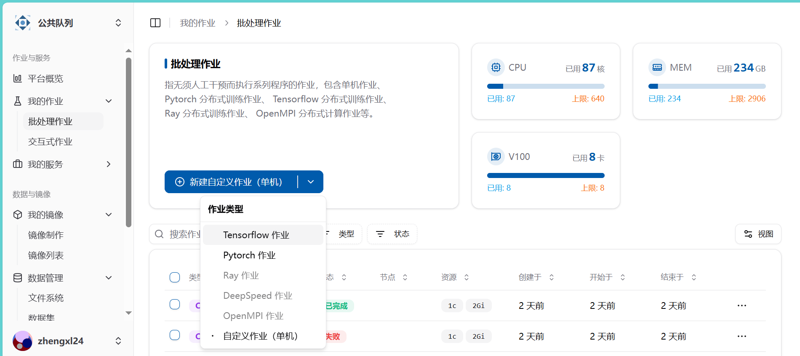
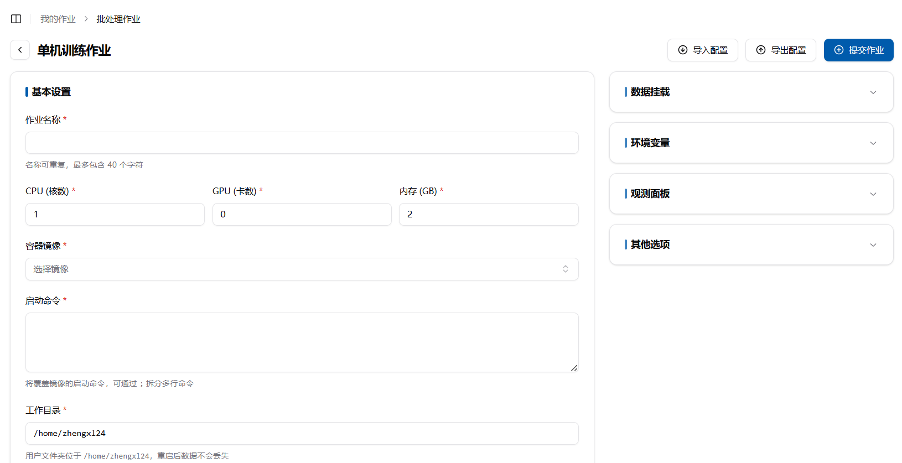
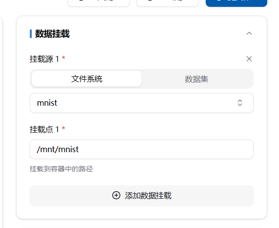
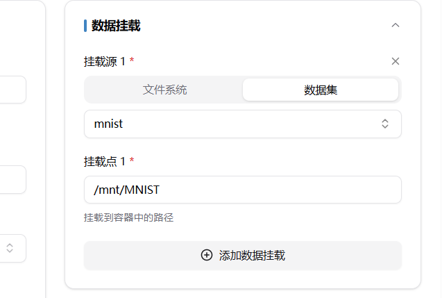
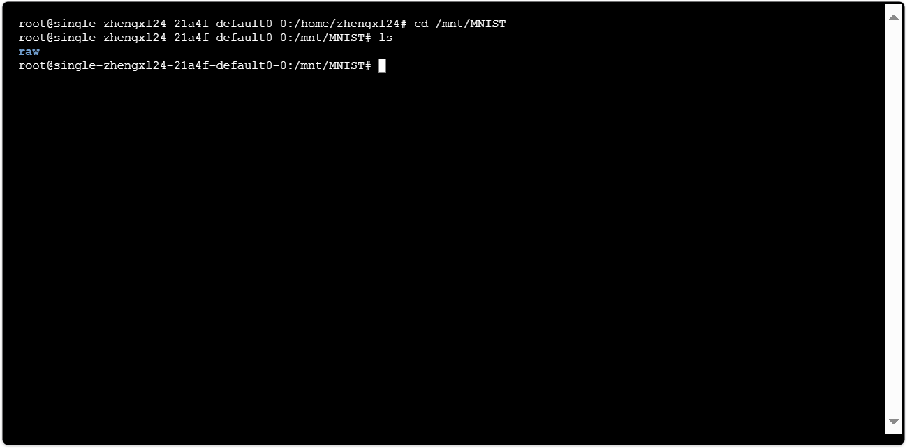
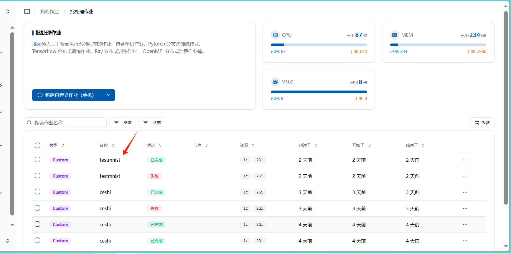
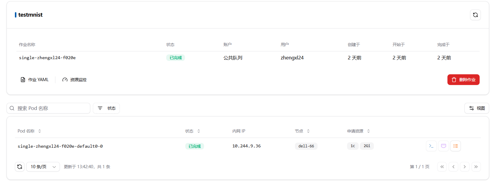
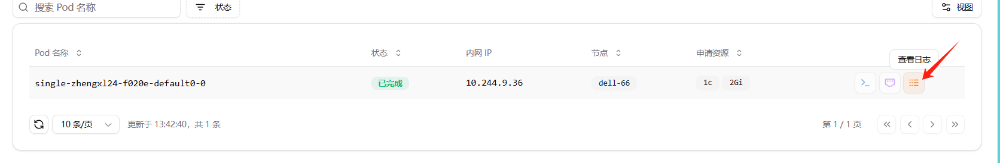
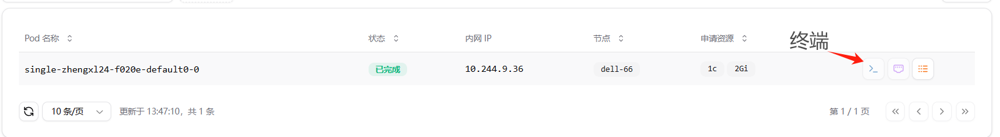

# 批处理作业

## 单机训练作业实现

### 作业提交

在批处理作业中选择自定义单机批处理作业



#### 填写作业信息



#### 容器镜像选择

可以选择公共镜像，也可选择自己的镜像，关于公共镜像的介绍以及如何创建自己的镜像在相关文档中

#### 启动命令

在 Docker 中，可以通过 `docker run` 命令的 `-c` 或 `--entrypoint` 选项来覆盖镜像的默认启动命令。**此系统的启动命令就是需要覆盖的命令。**如果你需要执行多行命令，可以使用 `;` 将它们连接起来。

以下是一个示例，展示如何使用 `docker run` 命令覆盖镜像的启动命令，并通过 `;` 拆分多行命令：

```bash
docker run -it --entrypoint /bin/bash nvcr.io/nvidia/k8s/container-toolkit:v1.17.1-ubuntu20.04 -c "command1; command2; command3"
```

在这个示例中：
- `--entrypoint /bin/bash`：覆盖了镜像的默认入口点，使用 `/bin/bash` 作为新的入口点。

- `-c "command1; command2; command3"`：传递一个包含多行命令的字符串，使用 `;` 分隔每个命令。

**在本系统中启动命令中需要填的内容即为command1; command2; command3**

##### 示例命令

假设你想在容器中执行以下多行命令：
1. 打开mnist文件夹
2. 用python 运行train.py

你可以这样写：

```bash
cd mnist;
python train.py
```

##### 注意事项
- 确保命令之间使用 `;` 分隔，这样它们会在同一个 shell 会话中顺序执行。
- 如果命令中包含特殊字符或空格，建议使用引号将整个命令字符串括起来，以避免解析错误。

通过这种方式，你可以在启动容器时覆盖镜像的默认启动命令，并执行多行命令。

#### 数据挂载

初始状态是挂载整个用户文件系统。这样可能后期导致文件系统过于复杂，建议设置合适的文件系统，然后将文件夹导入。一般来说，文件系统和数据集都会挂载到/mnt/文件夹下


如，导入用户空间下的mnist文件夹，可通过cd /mnt/mnist;指令来访问该文件夹



与文件夹情况类似，数据集挂载如下





##### 关于上传文件和创建数据集

因为文件只能一个一个上床，在上传本地数据集的时候，建议打包后上传，避免逐条上传

创建数据集可以实现该文件夹的通用

#### 作业运行状况查看

在成功创建作业后，会在批处理作业列表中看到刚刚创建的作业，点击作业名称可查看详情





作业运行过程中，可能会报错，比如因为无法打开相对应的文件夹，或者程序执行过程中出现问题，可通过查看日志查看作业运行情况




同时，在新建批处理作业的时候可能遇到一些环境问题，可通过在**启动命令**中添加sleep指令，来进行调试。如：

```
sleep 600;//让程序暂停10分钟
```

然后通过终端和日志查看你想查看的信息


