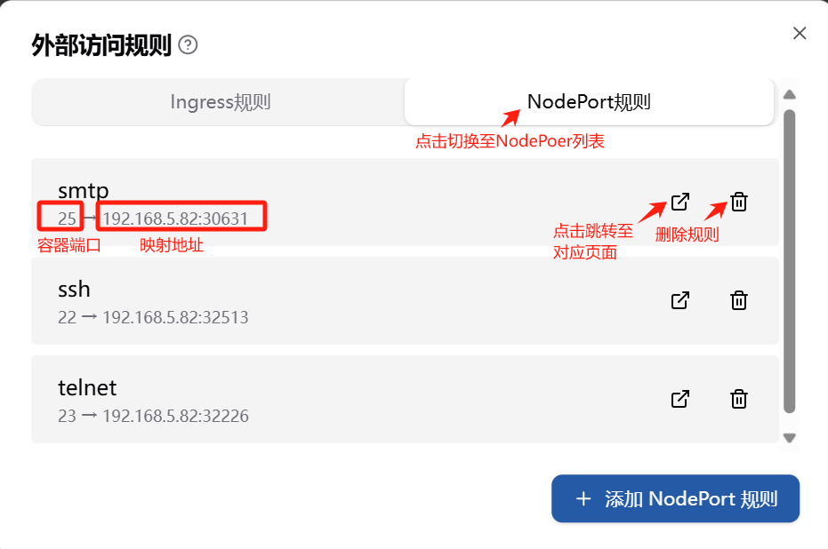
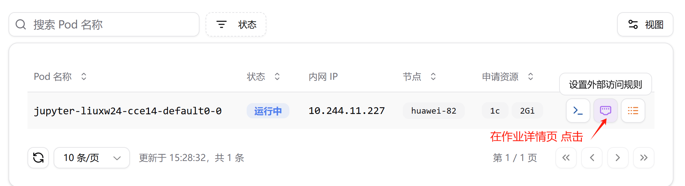
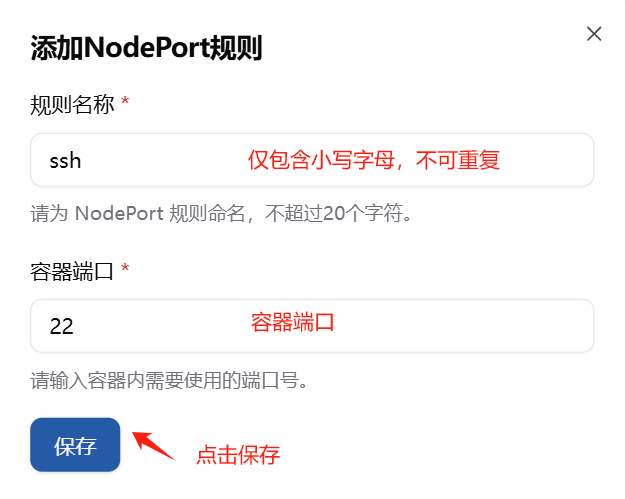
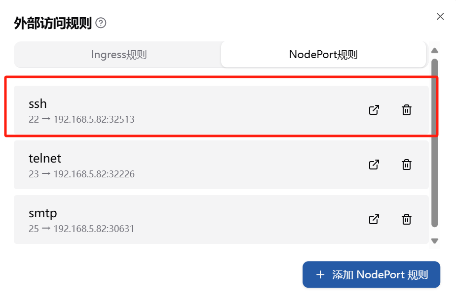
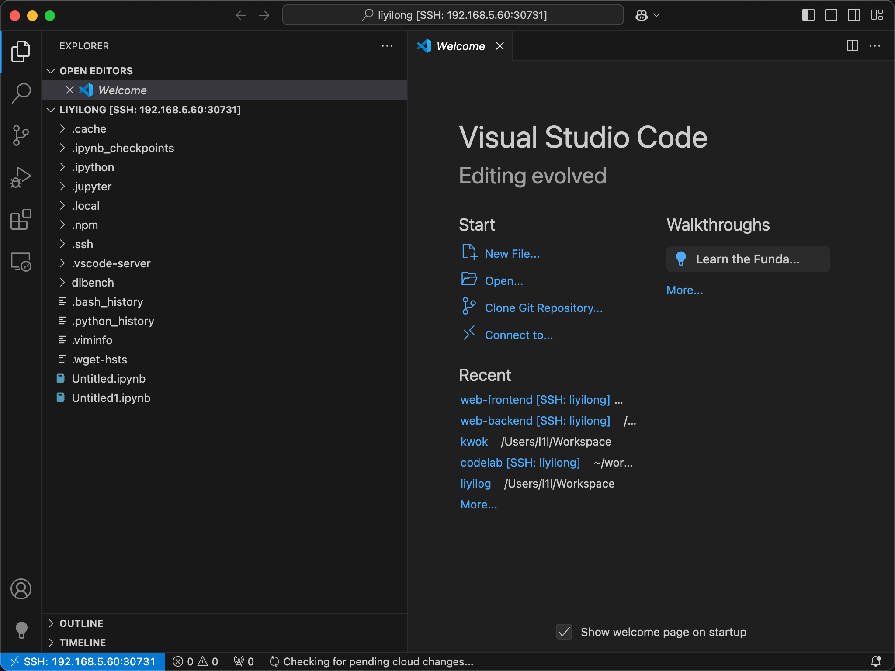

# NodePort 访问规则


## 2.1 功能介绍

**NodePort 规则** 允许您通过外部 IP 直接访问 Kubernetes 集群中的服务。与 Ingress 规则不同，NodePort 规则暴露的是服务的端口，并允许外部用户通过集群节点的 IP 地址和指定的端口号进行访问。NodePort 规则适用于需要外部访问的应用，如 **SSH 连接**。

在 NodePort 规则中，**Kubernetes 会自动从端口范围 30000 到 32767 中为服务分配一个端口号**。例如，如果您希望通过 SSH 连接到集群中的某个节点，Kubernetes 会为该服务分配一个端口，您可以通过该端口号从外部进行连接。

**优势**：

- 适用于需要外部直接访问的应用，如 SSH 连接。
- 自动为服务分配一个端口，简化了配置。
- 不依赖 HTTP/HTTPS 协议。

**使用场景**：

- 通过 SSH（端口 22）连接集群中的节点。
- 其他需要通过特定端口访问的应用。

**转发路径**： 可通过 `{nodeIP}:{nodePort}` 访问。其中，`nodeIP` 是集群任一节点的地址，`nodePort `为所分配的端口号。



设置完成后会在对应 Pod 的 `Annotations` 中看到如下内容，使用 `nodeport.crater.raids.io` 作为 `key` 值：

```yaml
metadata:
    annotations:
        crater.raids.io/task-name: tensorboard-example
        nodeport.crater.raids.io/smtp: '{"name":"smtp","containerPort":25,"address":"192.168.5.82","nodePort":30631}'
        nodeport.crater.raids.io/ssh: '{"name":"ssh","containerPort":22,"address":"192.168.5.82","nodePort":32513}'
        nodeport.crater.raids.io/telnet: '{"name":"telnet","containerPort":23,"address":"192.168.5.82","nodePort":32226}'
```


## 2.2 使用示例

当您希望通过外部 IP 地址访问某些应用（如 SSH 连接）时，可以使用 **NodePort 规则**。例如，您可以配置一个 NodePort 规则来暴露 SSH 端口（22 端口），以便通过 VSCode 等工具进行远程开发。

**设置 NodePort 外部访问规则的步骤如下：**

1. 在作业详情页点击 **“设置外部访问规则”** 。

   

2. 点击弹出的对话框中点击 **“添加 NodePort 规则”** ，输入对应的**规则名称**（仅包含小写字母，不超过20个字符，不可重复），以及**容器端口**，点击保存。

   

3. 保存成功后即可看到**相应的 NodePort 规则**。

   

**示例配置**：

```json
{
    "name":"ssh",
    "containerPort":22,
    "address":"192.168.5.82",
    "nodePort":32513
}
```

**字段说明**：

- **容器端口号** (`containerPort`): 选择 **22** 端口，通常用于 SSH 服务。
- **集群节点地址**(`address`): 集群任一节点的IP地址。
- **所分配的NodePort端口**(`nodePort`):  Kubernetes 会自动从端口范围 30000 到 32767 中为服务分配一个端口号。

**访问方式**：

- Kubernetes 会自动为 SSH 服务分配一个端口号，您可以使用该端口通过外部 IP 进行 SSH 连接（如通过 VSCode 远程开发）。
- 例如，Kubernetes 会为该服务分配一个端口（如 `32513`），您可以通过 `ssh user@<node-ip>:32513` 进行连接。

在 VSCode 中通过 NodePort 连接远程 Jupyter NoteBook 的效果如下：


