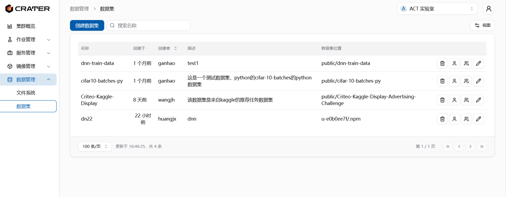
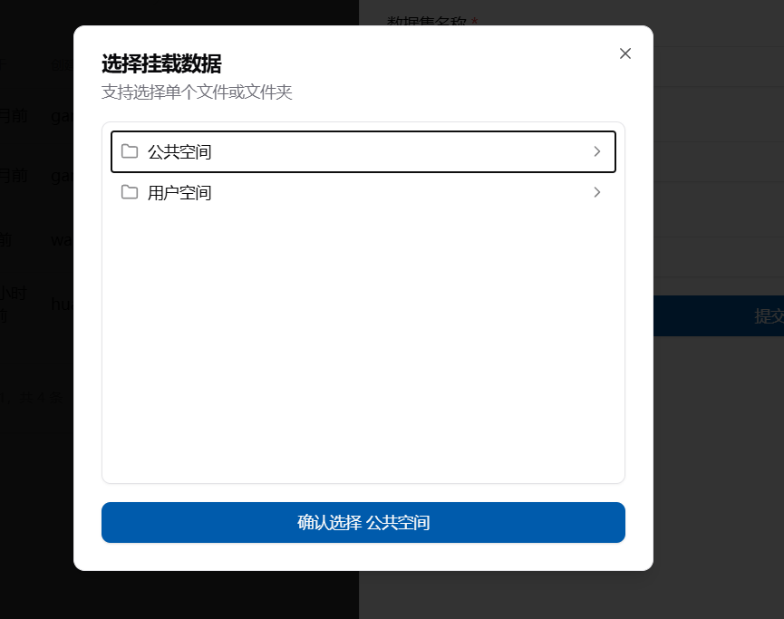
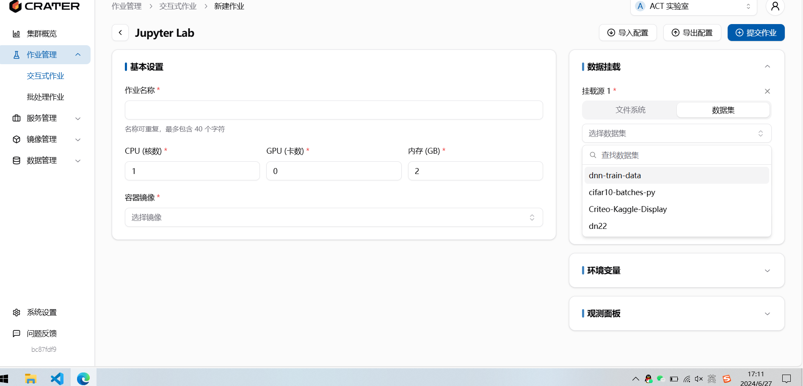

# 数据集

## 数据集是什么

目前的数据集其实是一个链接，将数据集指向一个特定的文件位置，这样可以更方便的进行挂载和分享。

## 在哪查看数据集

在`数据管理-数据集`下，可以查看数据集。这里显示的数据集包括用户自己创建的、个人被分享的和账户被分享的数据。

每个数据集会有一些基本描述，在右边有四个按钮，分别是删除，个人分享，账户分享和重命名。这些操作都需要数据集创建者才能使用。

## 怎么创建数据集

在数据集页面左上角有一个创建数据集按钮，点击后填写数据集名称、描述并选择文件夹位置进行创建。

创建的数据集名称不能相同，选择文件夹时会自动跳出你能看见的公共、个人及当前账户的空间文件，然后进行选择

## 怎么使用数据集

在新建作业的页面，右边有个数据挂载框，添加数据挂载后，可以选择数据集，然后将其挂载到容器内。

