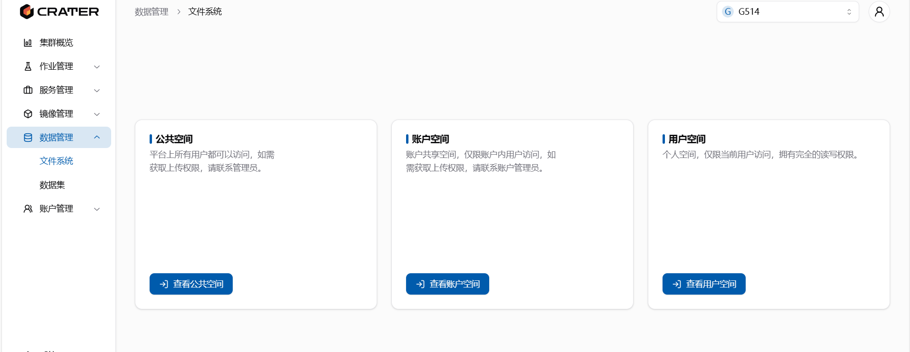
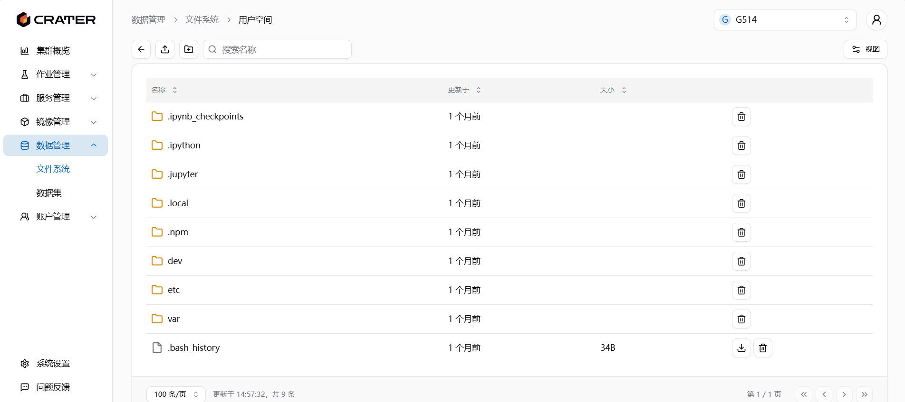
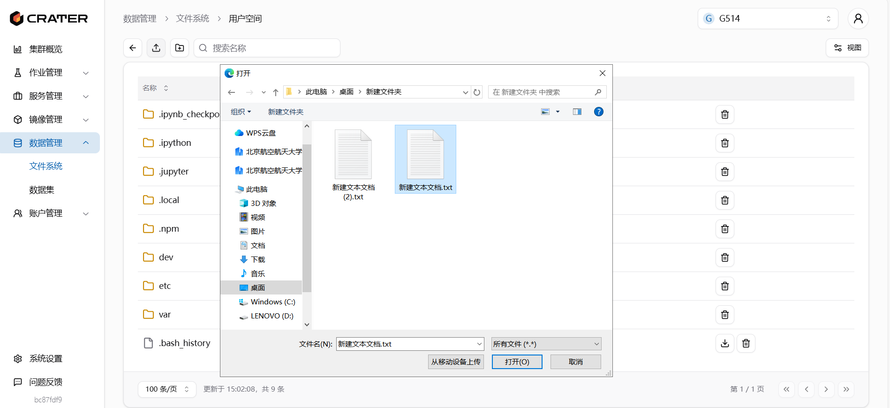
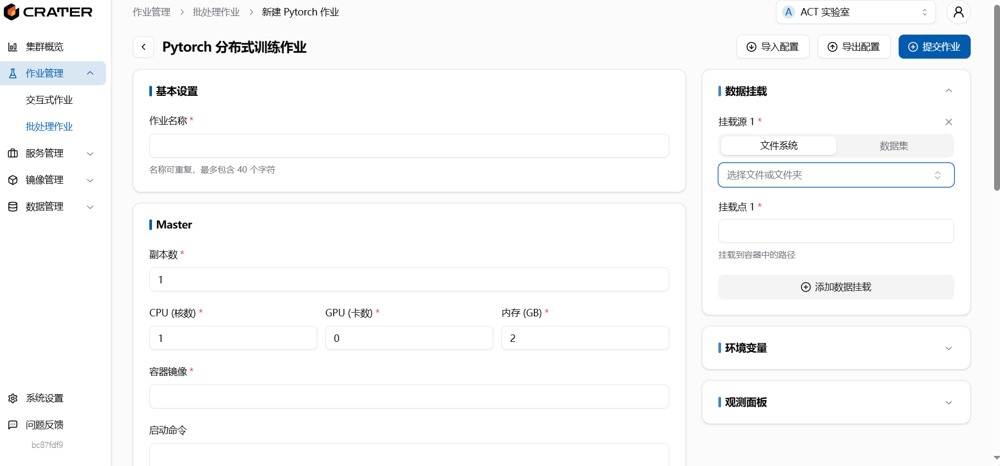
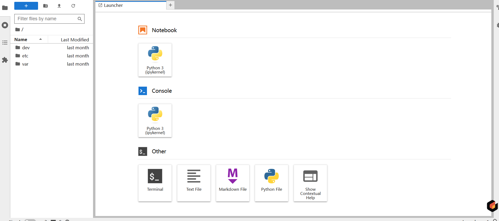

# 文件系统介绍

## 在哪里查看文件

在`数据管理-文件系统`下，可以发现三个空间：公共空间，账户空间和用户空间。
  
账户空间只有当你加入并选择了一个账户才会出现并可以查看。

## 怎么使用文件系统

以用户空间为例，进入后可以看见自己用户空间的文件。

文件/文件夹右边会有删除按钮，可以删除当前文件/文件夹，文件下载同样只有单个文件可以使用，如需下载文件夹，也需要打包文件夹才可以进行下载。

在左上角三个按键，分别是返回上一层，上传文件和创建文件夹。
上传文件一次只能上传单个文件，如需上传多个文件请压缩后进行上传。

上传文件大小限制 1G，如需上传更大的文件请使用 jupyter 或者联系管理员。

公共空间和账号空间里进行上传、删除等行为需要一定权限，请联系管理员获取权限

### 怎么挂载文件

在新建作业的页面，右边有个数据挂载框，添加数据挂载后，可以选择文件夹，选择文件夹时会自动跳出你能看见的公共、个人及当前账户的空间文件，然后进行选择，将其挂载到容器内



## 在 jupyter 里管理文件

如果运行一个 jupyter 任务，系统会自动将用户空间的文件挂载到 jupyter 的/home/user 上，可以在 jupyter 该目录上对文件进行修改。


jupyter 也自带文件创建、上传等功能，直接在这里对文件进行处理会更方便。

### 使用 scp 拷贝文件

先打开 jupyter 的 terminal，使用 scp 拷贝需要连接远程服务器，下面设置 ssh 连接。

在 terminal 里生成 ssh 密钥：

```bash
ssh-keygen -t ed25519
```

将`~/.ssh/id_ed25519.pub`里的公钥复制，在需要传输文件的服务器创建文件`~/.ssh/authorized_keys`，将公钥内容拷贝上去。

连接远程服务器后就可以使用 scp 进行文件传输了。  
输入如下命令行下载 scp 包。

```bash
sudo apt-get update
sudo apt-get install openssh-client
```

scp 的基本用法如下：

```bash
scp [选项] [源文件] [目标地址]
```

例如，要将本地的文件 file.txt 上传到远程服务器的/tmp 目录下，可以使用以下命令：

```bash
scp file.txt user@remote-host:/tmp
```

这个命令会将 file.txt 文件传输到远程服务器的/tmp 目录下。你需要将 user 替换为远程服务器的用户名，remote-host 替换为远程服务器的地址或 IP。
同样地，你也可以从远程服务器上下载文件到本地
