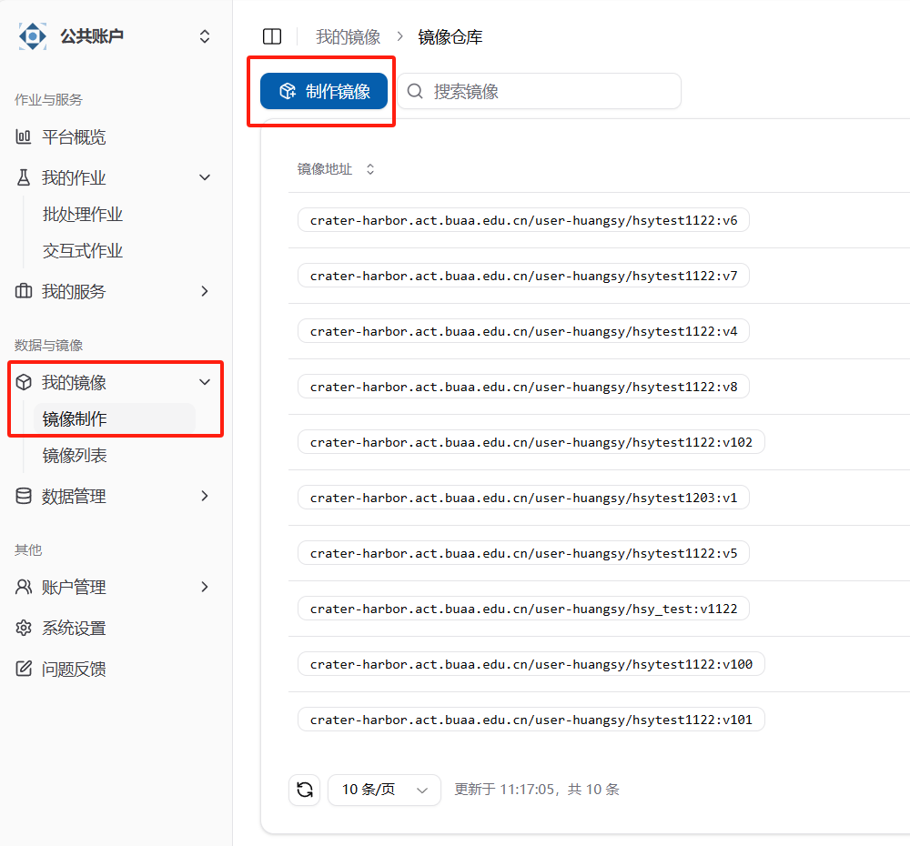
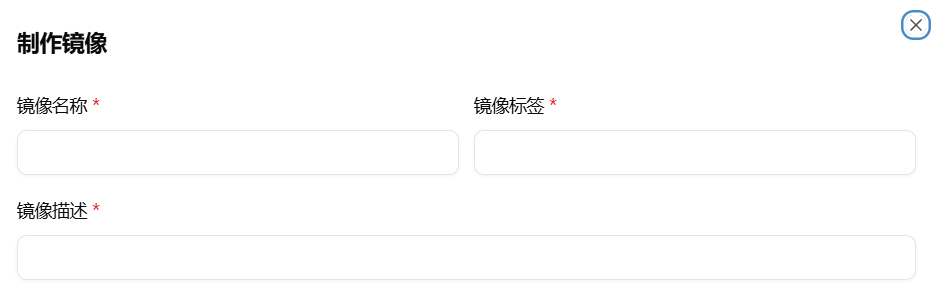
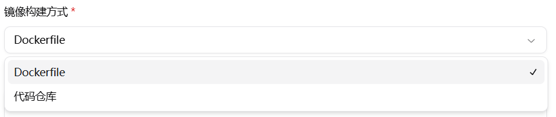
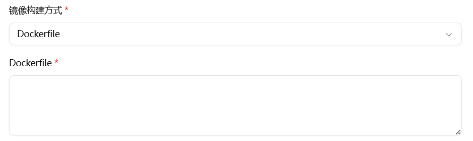
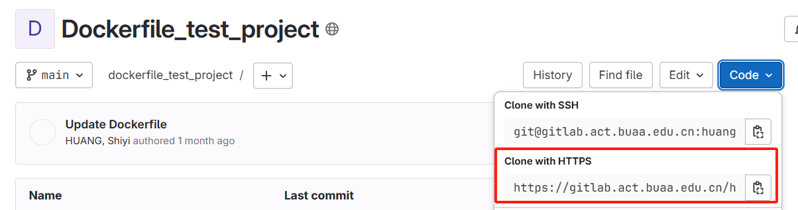
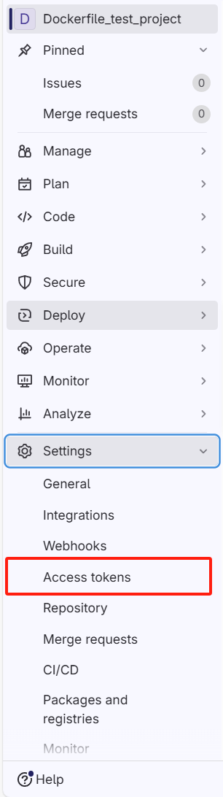
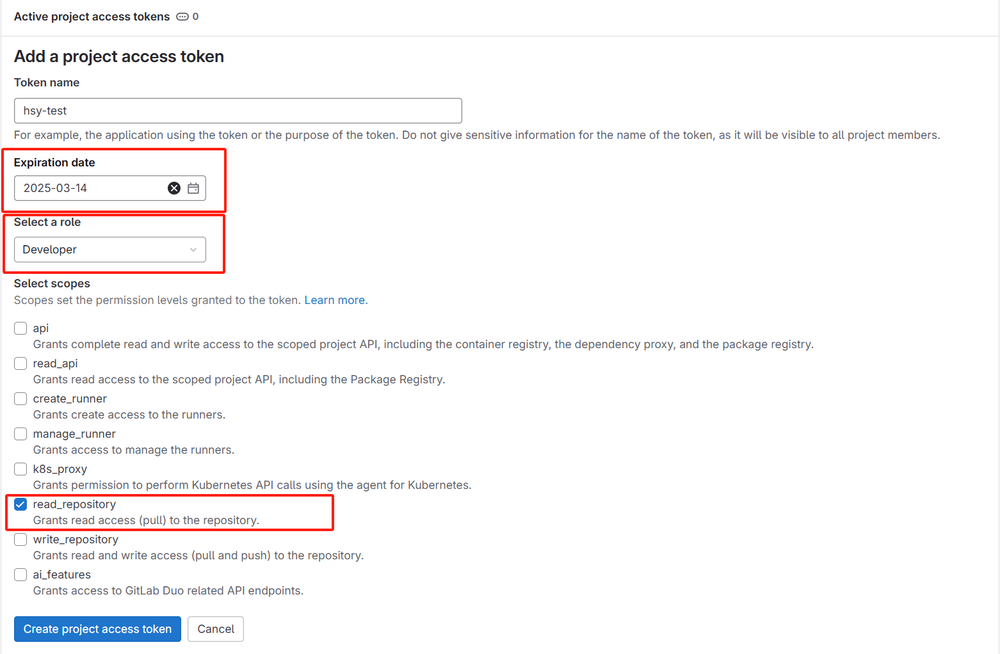
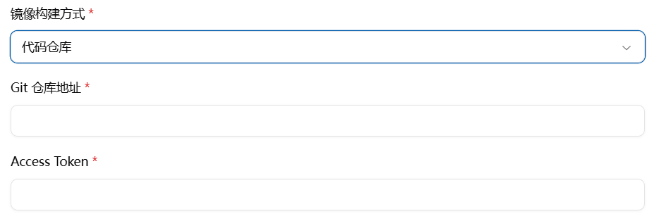

# 镜像制作

## 点击“制作镜像”按钮



## 填写镜像基础信息



## 选择镜像构建方式



### 1. 对于 Dockerfile 的构建方式：

1. 需要提供完整的 Dockerfile，如：

```dockerfile
# 使用ubuntu作为基础镜像
FROM crater-harbor.act.buaa.edu.cn/docker.io/library/ubuntu:latest
# 安装Python3和pip3
RUN apt  update \
    &&  apt -y install python3

# 设置工作目录
WORKDIR /app
# 容器启动时执行的命令，可以根据需要修改
CMD ["bash"]
```

2. 在选择镜像（FROM 语句）时，最好将镜像名加上`crater-harbor.act.buaa.edu.cn`前缀，走实验室 harbor 代理
3. 将完整的 Dockerfile 输入即可



### 2. 对于代码仓库的构建方式：

1. Git 仓库地址选择 HTTPS 的链接，复制



2. 在 Git 仓库中生成项目的 Access Token



3. 生成最小权限的 Access Token



4. 点击`Create project access token`，复制
5. 将上述获得的 Git 仓库地址和 Access Token 输入即可


