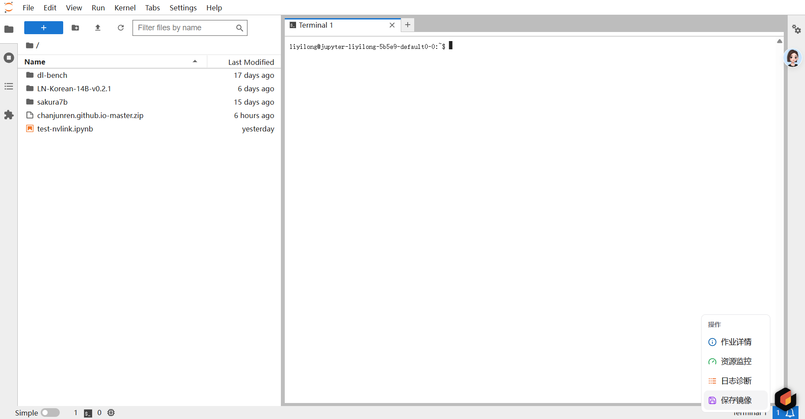
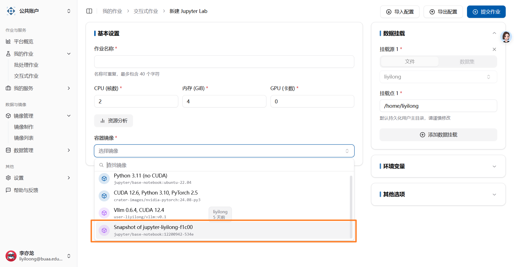

# 镜像保存

当用户在 Jupyter 环境内安装了新的 Python 包后，如果停止作业，那么默认情况下这些 Python 包将会丢失。

为此，我们提供了镜像保存功能，可以直接保存用户当前的改动为镜像，从而方便下次使用。

:::warning

由于深度学习的镜像通常很大，过程中网络等因素都会存在干扰，难以保证镜像保存的成功率。我们还是建议您尽量通过 Dockerfile 或者低代码的方式制作镜像。

此外，内测阶段暂时没有限制，但后续我们可能会限制：

1. 用户可上传镜像的总大小
2. 用户可进行镜像保存的数量（为了保存新的，必须删除旧的）

总结：我们非常建议您通过 Dockerfile 或者低代码的方式制作镜像！

:::

## 启动 Jupyter 示例

请参考 [交互式作业](./quick-start/interactive.md) 启动 Jupyter Lab。

之后，您可能会在这个容器内执行一些操作，例如安装一个 Pip 包：

```shell
# 使用 aliyun 的 Pip 源
sudo pip config set global.index-url https://mirrors.aliyun.com/pypi/simple/

# 安装任意的包
sudo pip install jieba
```

## 保存镜像内的改动

在 Jupyter 交互式页面，找到 Crater 图标的悬浮球：



点击保存镜像，并确认。

:::warning

内测阶段暂时没有限制，但后续我们可能会限制：

1. 用户可上传镜像的总大小
2. 用户可进行镜像保存的数量（为了保存新的，必须删除旧的）

:::

Crater 平台会将您重定向到镜像制作页面，在这里，您可以了解镜像打包任务的具体进度。成功之后，可以在选择镜像时，看到描述为 `Snapshot of XXXX` 的镜像。


