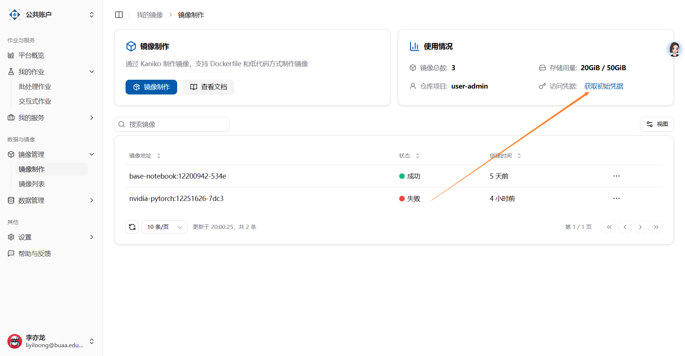

# 上传本地镜像

:::warning

这是由人工智能生成的内容，但基本正确，介意的话，请等待我们的开发人员撰写更合适的版本。

:::

本文档将指导您如何通过平台获取 Harbor 访问凭证，并将本地的 Docker 镜像上传到 Harbor 仓库中。

## 1. 获取 Harbor 访问凭证

### 1.1 登录平台

首先，登录到您的平台（例如 Kubernetes 集群管理平台、CI/CD 平台等），找到与 Harbor 集成的部分。



### 1.2 获取访问凭证

在平台的 Harbor 集成页面，您可以找到以下信息：

- **Harbor URL**: Harbor 仓库的地址，例如 `https://harbor.example.com`。
- **用户名**: 您的 Harbor 用户名。
- **密码**: 您的 Harbor 密码。

### 1.3 登录 Harbor

使用获取到的凭证登录 Harbor：

```bash
docker login crater-harbor.act.buaa.edu.cn -u <用户名> -p <密码>
```

登录成功后，您将看到 `Login Succeeded` 的提示。

## 2. 上传本地镜像到 Harbor 仓库

### 2.1 标记本地镜像

在上传之前，您需要将本地镜像标记为符合 Harbor 仓库的命名规范。例如：

```bash
docker tag local-image:tag harbor.example.com/project-name/repository-name:tag
```

- `local-image:tag`: 您本地的镜像名称和标签。
- `harbor.example.com/project-name/repository-name:tag`: Harbor 仓库的完整路径，包括项目名称、仓库名称和标签。

每个用户的 Project Name 是 `user-{ACT 用户名}`。

### 2.2 推送镜像到 Harbor

使用 `docker push` 命令将标记好的镜像推送到 Harbor 仓库：

```bash
docker push harbor.example.com/project-name/repository-name:tag
```

推送成功后，您可以在 Harbor 仓库中看到上传的镜像。

## 3. 验证镜像上传

### 3.1 登录 Harbor Web UI

打开浏览器，访问 Harbor 的 Web UI（例如 `https://harbor.example.com`），并使用您的凭证登录。

### 3.2 查看镜像

导航到相应的项目和仓库，确认您上传的镜像已成功显示在仓库中。

## 4. 常见问题

### 4.1 登录失败

- 确保用户名和密码正确。
- 检查 Harbor URL 是否正确，并且网络可以访问。

### 4.2 推送失败

- 确保镜像标记的路径正确。
- 检查您是否有权限将镜像推送到指定的项目和仓库。

## 5. 参考文档

- [Harbor 官方文档](https://goharbor.io/docs/)
- [Docker 官方文档](https://docs.docker.com/)
