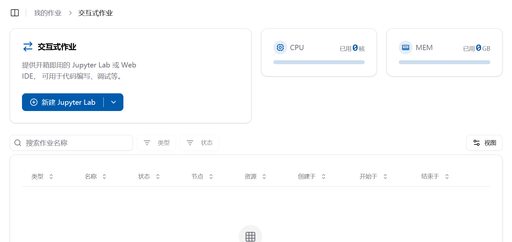
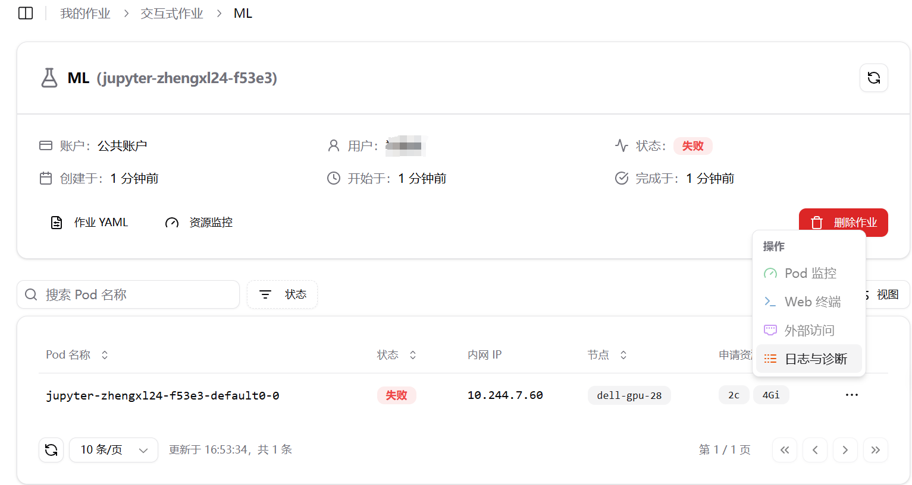

# 用户手册

:::tip 注意

有关平台的任何问题，建议您先在右上角的“搜索”框输入并查找！

:::

## 平台简介

Crater 是一款北航自主研发，专门用于集群管理的平台，为集群用户提供了高效、便捷的集群资源管理方案。它能够对集群中的计算资源、存储资源等进行统一的调度和管理，确保集群的稳定运行和资源的优化利用。

### 直观的界面设计

Crater 提供了简洁、易用的用户界面，用户可以通过图形化的操作界面轻松完成各种集群管理任务。例如，通过资源仪表盘能够实时展示集群资源的使用情况，包括 CPU 使用率、内存占用、存储容量等指标。

作业管理界面可以呈现正在运行的作业、作业队列以及作业历史记录，方便用户随时查看任务状态和进行操作。

### 高效的资源调度

平台采用智能的资源调度算法，根据作业的优先级、资源需求等因素，自动分配最优的资源给作业。例如，当有多个作业同时请求资源时，Crater 能够快速分析并将资源分配给最紧急、最关键的任务，提高整体执行效率。

### 监控功能

详细的监控数据和日志记录为用户提供了深入了解集群运行情况的依据，方便用户进行故障排查和性能优化。

## 目录

本手册可帮助集群用户学习如何访问平台，使用交互式作业和批处理作业、提交数据、制作镜像以及 VSCode 扩展访问等功能

1. [平台访问](./quick-start/login.md)
2. [交互式作业](./quick-start/interactive.md)
3. [批处理作业](./quick-start/batchprocess.md)
4. [文件系统](./file/file.md)
5. [数据集](./file/dataset.md)
6. [镜像制作](./image/imagebuild.md)

---

希望本手册能帮助你充分利用集群平台的功能！
