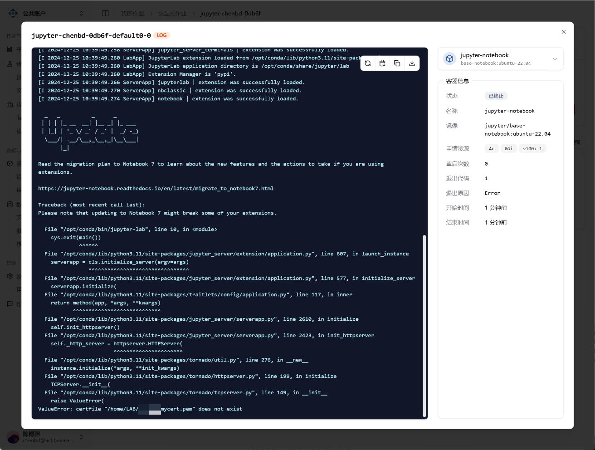

# Jupyter Lab 启动失败

:::tip TL;DR

很可能因为您之前配置过 Jupyter，删除用户文件夹下的 `.jupyter` 文件夹即可。

:::

## 1. 因 Jupyter Pem 文件硬编码导致启动失败

2024 年 12 月 25 日反馈，用户启动日志如下所示：

交互式作业启动失败，原因是找不到 `/home/LAB/{username}/mycert.pem`，这是因为我们同步了用户在 Slurm 旧集群的文件，用户在之前的 Slurm 集群的 Home 目录是 `/home/LAB/{username}`，目前则是更加标准的 `/home/{username}`。

同时，用户之前在 Slurm 集群配置过 Jupyter 的 TLS 连接，因此在 `/home/{username}/.jupyter` 文件夹下的 Jupyter 配置文件中，硬编码了 pem 证书的路径。

为此有两种解决方法：

1. 删除 `/home/{username}/.jupyter` 文件夹
2. 修改 `jupyter_notebook_config.py` 文件的第 161 行，把路径变成 `$HOME/mycert.pem`
