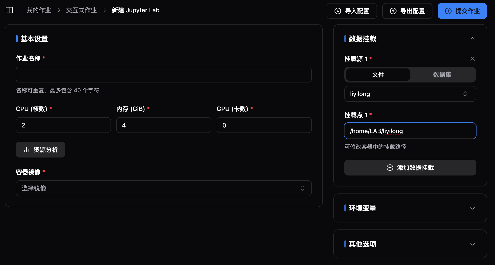

# 从 Slurm 集群迁移环境指南

## 概述

在计算集群升级或迁移过程中，环境迁移是一个关键步骤。本文将指导您如何将现有的 Slurm 集群环境迁移到新的计算平台。我们将重点介绍两种主要方法：直接复用现有 Conda 环境和基于现有环境重建 Python 环境。

## 1. 复用现有 Conda 环境

:::tip

虽然可以直接复用现有的 Conda 环境，但我们建议谨慎考虑以下因素：

- **性能影响**：在 Docker 容器内重新安装 Python 环境通常会有更好的执行效率
- **兼容性问题**：直接复用环境可能导致路径依赖问题
- **环境整洁度**：现有环境可能包含不再使用的依赖包

:::

1. **路径调整**：
   修改挂载路径，将 `/home/{username}` 替换为 `/home/LAB/{username}`，以对齐 Slurm 集群，解决路径硬编码问题。如果您不需要复用环境，可以跳过这一步。

   

2. **环境激活**：
   执行类似以下命令激活现有环境：

   ```bash
   export USERNAME=liyilong
   export PATH=/home/LAB/${USERNAME}/miniconda3/bin:${PATH}
   source /home/LAB/${USERNAME}/miniconda3/etc/profile.d/conda.sh
   export PATH=$CONDA_DIR/bin:${PATH}
   ```

3. **验证环境**：
   使用以下命令验证环境是否激活成功：

   ```bash
   conda activate
   ```

## 2. 基于现有环境重建 Python 环境

:::tip

- **环境纯净**：可以去除不再使用的依赖
- **性能优化**：新的安装通常会有更好的性能表现
- **可维护性**：明确的依赖列表便于后续维护

:::

1. **生成 Requirements 文件**：
   使用 pipreqs 等扫描项目目录，生成准确的依赖列表：

   ```bash
   pip install pipreqs
   pipreqs /path/to/project --encoding=utf8 --force
   ```

2. **优化依赖列表**：

   - 手动检查生成的 requirements.txt 文件
   - 移除不再使用的依赖
   - 固定关键依赖的版本号

3. **创建新环境**：请参考镜像制作一节，可以基于多种方式创建新的环境。

## 结论

我们建议优先选择第二种方法（重建环境），虽然需要更多初始工作，但可以带来更好的长期维护性和性能表现。如果时间紧迫，第一种方法（复用环境）可以作为临时解决方案，但建议后续仍要进行环境重建。

> 注意：在进行环境迁移时，请务必做好备份，并记录所有操作步骤，以便在出现问题时可以快速回滚。
