# 批处理作业

## 提交一个PyToch手写识别GPU训练作业

Crater的 **单机批处理任务** 用于在一个特定环境下按既定的指令执行并获得结果。

## 上传代码

### 在本地创建代码

在本地创建好要执行的代码文件。鉴于批处理系统在代码调试环节存在诸多不便之处，建议仅将在本地已成功调试且可正常执行的代码，应用于批处理系统之中，以保障整体业务流程的顺畅推进与稳定性。

```python
#本代码参考github PyToch手写识别GPU训练任务实例
import argparse
import torch
import torch.nn as nn
import torch.nn.functional as F
import torch.optim as optim
from torchvision import datasets, transforms
from torch.optim.lr_scheduler import StepLR


class Net(nn.Module):
    def __init__(self):
        super(Net, self).__init__()
        self.conv1 = nn.Conv2d(1, 32, 3, 1)
        self.conv2 = nn.Conv2d(32, 64, 3, 1)
        self.dropout1 = nn.Dropout(0.25)
        self.dropout2 = nn.Dropout(0.5)
        self.fc1 = nn.Linear(9216, 128)
        self.fc2 = nn.Linear(128, 10)

    def forward(self, x):
        x = self.conv1(x)
        x = F.relu(x)
        x = self.conv2(x)
        x = F.relu(x)
        x = F.max_pool2d(x, 2)
        x = self.dropout1(x)
        x = torch.flatten(x, 1)
        x = self.fc1(x)
        x = F.relu(x)
        x = self.dropout2(x)
        x = self.fc2(x)
        output = F.log_softmax(x, dim=1)
        return output


def train(args, model, device, train_loader, optimizer, epoch):
    model.train()
    for batch_idx, (data, target) in enumerate(train_loader):
        data, target = data.to(device), target.to(device)
        optimizer.zero_grad()
        output = model(data)
        loss = F.nll_loss(output, target)
        loss.backward()
        optimizer.step()
        if batch_idx % args.log_interval == 0:
            print('Train Epoch: {} [{}/{} ({:.0f}%)]\tLoss: {:.6f}'.format(
                epoch, batch_idx * len(data), len(train_loader.dataset),
                100. * batch_idx / len(train_loader), loss.item()))
            if args.dry_run:
                break


def test(model, device, test_loader):
    model.eval()
    test_loss = 0
    correct = 0
    with torch.no_grad():
        for data, target in test_loader:
            data, target = data.to(device), target.to(device)
            output = model(data)
            test_loss += F.nll_loss(output, target, reduction='sum').item()  # sum up batch loss
            pred = output.argmax(dim=1, keepdim=True)  # get the index of the max log-probability
            correct += pred.eq(target.view_as(pred)).sum().item()

    test_loss /= len(test_loader.dataset)

    print('\nTest set: Average loss: {:.4f}, Accuracy: {}/{} ({:.0f}%)\n'.format(
        test_loss, correct, len(test_loader.dataset),
        100. * correct / len(test_loader.dataset)))


def main():
    # Training settings
    parser = argparse.ArgumentParser(description='PyTorch MNIST Example')
    parser.add_argument('--batch-size', type=int, default=64, metavar='N',
                        help='input batch size for training (default: 64)')
    parser.add_argument('--test-batch-size', type=int, default=1000, metavar='N',
                        help='input batch size for testing (default: 1000)')
    parser.add_argument('--epochs', type=int, default=2, metavar='N',
                        help='number of epochs to train (default: 2)')
    parser.add_argument('--lr', type=float, default=1.0, metavar='LR',
                        help='learning rate (default: 1.0)')
    parser.add_argument('--gamma', type=float, default=0.7, metavar='M',
                        help='Learning rate step gamma (default: 0.7)')
    parser.add_argument('--no-cuda', action='store_true', default=False,
                        help='disables CUDA training')
    parser.add_argument('--no-mps', action='store_true', default=False,
                        help='disables macOS GPU training')
    parser.add_argument('--dry-run', action='store_true', default=False,
                        help='quickly check a single pass')
    parser.add_argument('--seed', type=int, default=1, metavar='S',
                        help='random seed (default: 1)')
    parser.add_argument('--log-interval', type=int, default=10, metavar='N',
                        help='how many batches to wait before logging training status')
    parser.add_argument('--save-model', action='store_true', default=True,
                        help='For Saving the current Model')
    args = parser.parse_args()
    use_cuda = not args.no_cuda and torch.cuda.is_available()
    use_mps = not args.no_mps and torch.backends.mps.is_available()

    torch.manual_seed(args.seed)

    if use_cuda:
        device = torch.device("cuda")
    elif use_mps:
        device = torch.device("mps")
    else:
        device = torch.device("cpu")

    train_kwargs = {'batch_size': args.batch_size}
    test_kwargs = {'batch_size': args.test_batch_size}
    if use_cuda:
        cuda_kwargs = {'num_workers': 1,
                       'pin_memory': True,
                       'shuffle': True}
        train_kwargs.update(cuda_kwargs)
        test_kwargs.update(cuda_kwargs)

    transform=transforms.Compose([
        transforms.ToTensor(),
        transforms.Normalize((0.1307,), (0.3081,))
        ])
    dataset1 = datasets.MNIST('../data', train=True, download=True,
                       transform=transform)
    dataset2 = datasets.MNIST('../data', train=False,
                       transform=transform)
    train_loader = torch.utils.data.DataLoader(dataset1,**train_kwargs)
    test_loader = torch.utils.data.DataLoader(dataset2, **test_kwargs)

    model = Net().to(device)
    optimizer = optim.Adadelta(model.parameters(), lr=args.lr)

    scheduler = StepLR(optimizer, step_size=1, gamma=args.gamma)
    for epoch in range(1, args.epochs + 1):
        train(args, model, device, train_loader, optimizer, epoch)
        test(model, device, test_loader)
        scheduler.step()

    if args.save_model:
        torch.save(model.state_dict(), "mnist_cnn.pt")


if __name__ == '__main__':
    main()
```

### 将本地代码上传

在系统中打开数据管理的文件系统并进入用户空间

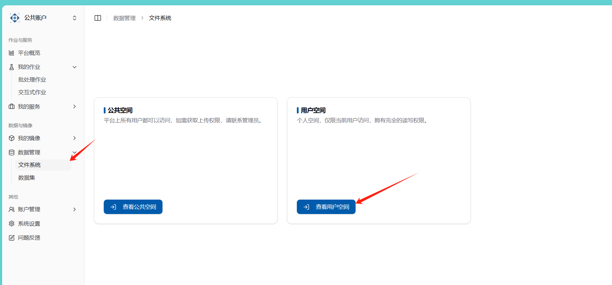

可以通过为项目单独新建一个文件夹，然后将相关文件导入。

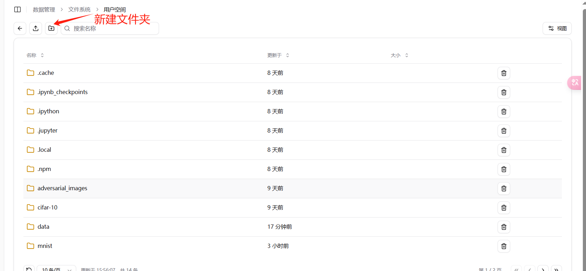

本示例中将 train.py 文件导入到 mnist 文件夹中

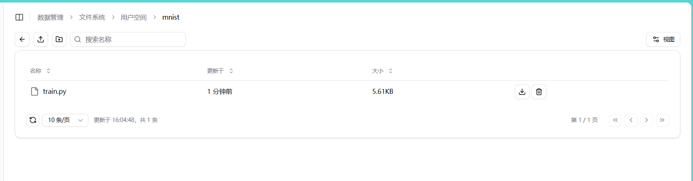

## 作业提交

在批处理作业中选择自定义单机批处理作业

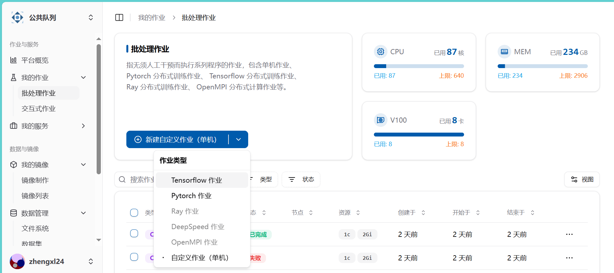

### 填写作业信息

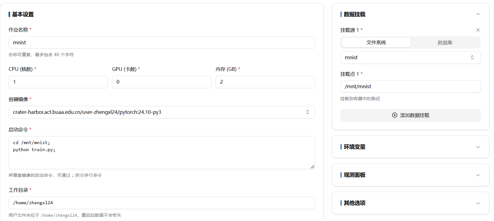

### 容器镜像选择

可以选择公共镜像，也可选择自己的镜像，关于公共镜像的介绍以及如何创建自己的镜像在相关文档中

### 启动命令

#### 示例命令

```bash
cd /mnt/mnist;
python train.py
```

1. 打开/mnt/mnist 文件夹
2. 用 python 运行 train.py

#### 注意事项

- 确保命令之间使用 `;` 分隔，这样它们会在同一个 shell 会话中顺序执行。
- 如果命令中包含特殊字符或空格，建议使用引号将整个命令字符串括起来，以避免解析错误。

通过这种方式，你可以在启动容器时覆盖镜像的默认启动命令，并执行多行命令。

### 数据挂载

初始状态是挂载整个用户文件系统。一般来说，文件系统和数据集都会挂载到/mnt/文件夹下

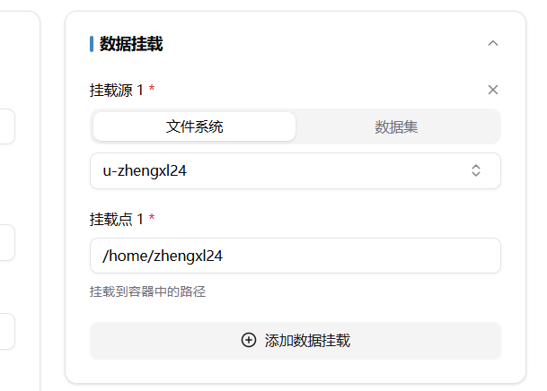

如，导入用户空间下的 mnist 文件夹，可通过 cd /mnt/mnist;指令来访问该文件夹

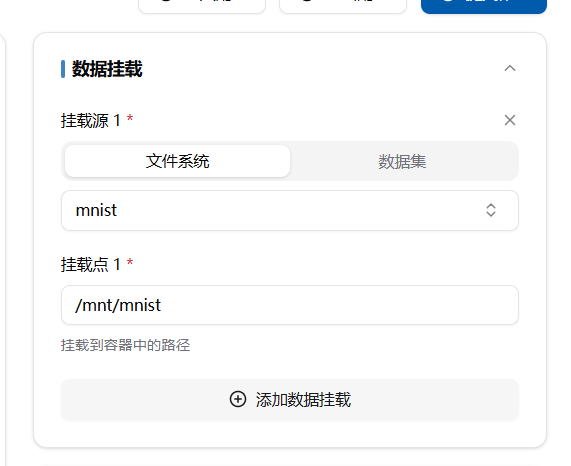

与文件夹情况类似，数据集挂载其实是将包含数据集的文件夹整体挂载到/mnt/文件夹下，具体如下

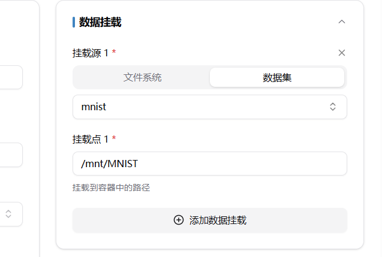

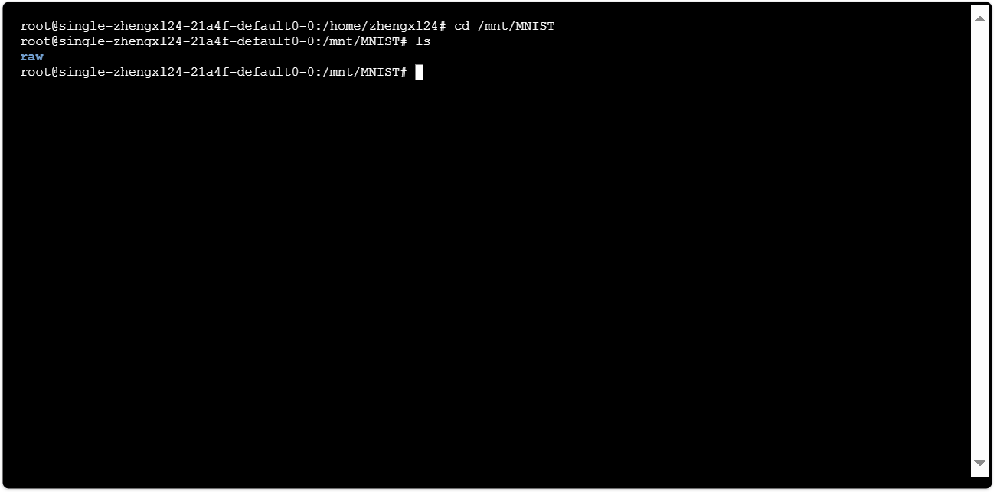

## 作业运行状况查看

在成功创建作业后，会在批处理作业列表中看到刚刚创建的作业，点击作业名称可查看详情

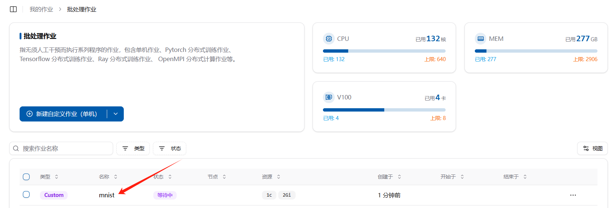

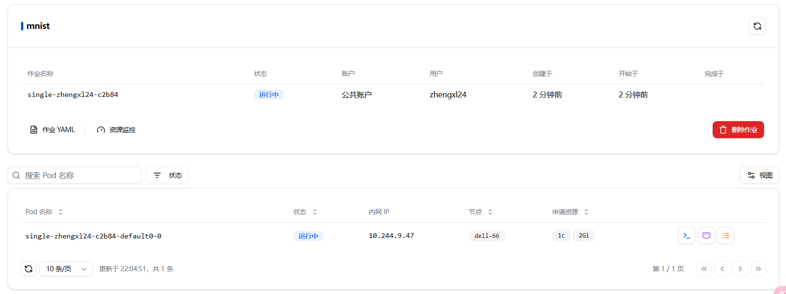

作业运行过程中，可能会报错，比如因为无法打开相对应的文件夹，或者程序执行过程中出现问题，可通过查看日志查看作业运行情况

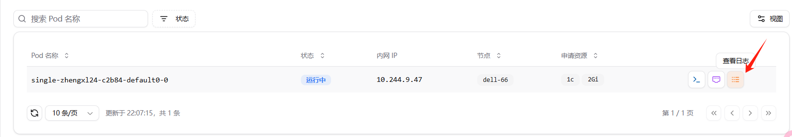

此时表示程序正在下载数据集，因系统代理问题可能下载速度较慢，可提前下载数据集上传

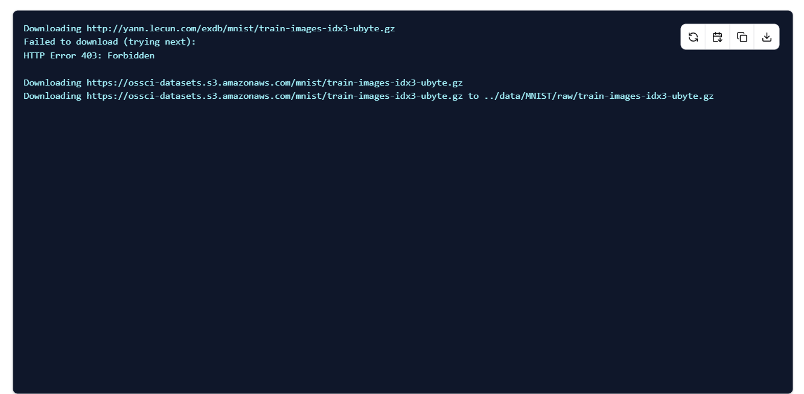

状态变**已完成**表示批处理作业已顺利执行成功，失败则表示存在问题，可通过日志查看


#### 其他查看作业运行情况的方法

同时，在新建批处理作业的时候可能遇到一些环境问题，可通过在**启动命令**中添加 sleep 指令，来进行调试。如：

```
sleep 600;//让程序暂停10分钟
```

然后通过终端和日志查看你想查看的信息

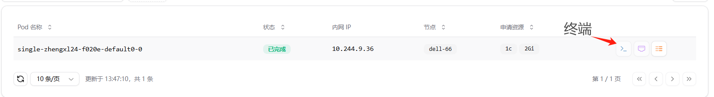

## 作业结果保存

在执行文件中保存在镜像空间的当前文件夹下的内容会保存到用户空间的源文件夹中，如在示例代码中，运行后会将 mnist_cnn.pt 保存到 train.py 所在的源文件夹 mnist 中

```
torch.save(model.state_dict(), "mnist_cnn.pt")
```

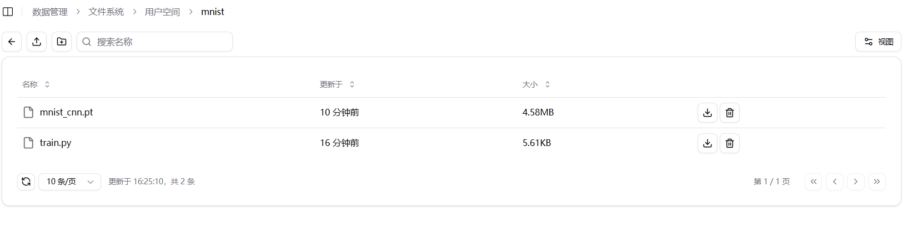
