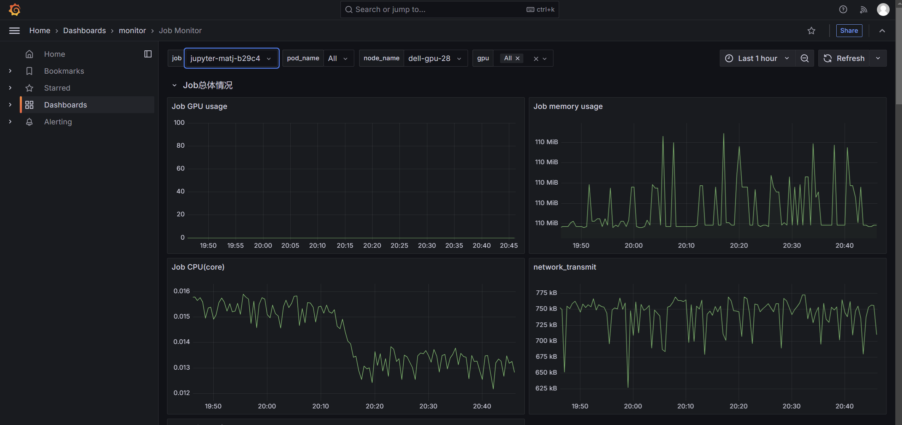

# 交互式作业

**交互式作业**功能为用户提供了**开箱即用的 Jupyter Lab 和 Web IDE** ，本文档旨在阐述交互式作业的创建和管理等相关内容。

## 创建交互式作业

可在 **“平台概览”** 页面或 **“我的作业” -> ”交互式作业“** 页面点击 **”新建 Jupyter Lab“** 按钮，进入  Jupyter Lab 的新建页面。


在 **“新建 Jupyter Lab”** 页面可以**对交互式作业进行各项设置**：

- 作业名称
- 作业资源（包括CPU核数、内存使用量、是否使用GPU、以及选择所使用的GPU型号）
- 容器镜像
- 设置数据挂载目录
- 添加环境变量
- 其他选项
  - 接收状态通知
  - 启用节点选择功能


交互式作业各项设置可采用**导入配置文件**进行，已经设置完成的作业也可以**导出配置文件**，示例如下：

```json
{
  "version": "20240528",
  "type": "jupyter",
  "data": {
    "taskname": "DL-bench-test",
    "cpu": 2,
    "gpu": {
      "count": 1,
      "model": "nvidia.com/a100"
    },
    "memory": 4,
    "image": "harbor.act.buaa.edu.cn/crater-images/nvidia-pytorch:24.08-py3",
    "volumeMounts": [
      {
        "type": 1,
        "subPath": "liuxw24",
        "mountPath": "/home/liuxw24"
      }
    ],
    "envs": [],
    "observability": {
      "tbEnable": false
    },
    "nodeSelector": {
      "enable": false
    }
  }
}
```

可以看到提交的作业已经成功运行。


## 管理已创建作业

- 点击作业名称可以跳转至作业详情页
- 详情：跳转至作业详情页
- 克隆：可使用当前作业配置克隆作业（方便用户重复提交类似配置的作业）
- 停止：停止当前作业，并释放所占用资源


点击“克隆”可以看到如下页面：


可以看到自动创建了和被克隆作业相同配置的作业（自动填充），用户可以略作调整后提交。

## 作业详情页

作业详情页包含了作业所属账户、作业创建者、作业状态、创建时间、开始时间、完成时间等基本信息。

同时提供所种对作业进行监控与管理的方式。


### 作业YAML

- 作业YAML：点击可以查看作业YAML文件


### 资源监控

- 资源监控：点击跳转至作业Grafana监控页面



### 交互式页面

- 交互式页面：点击跳转至Jupyter Notebook


### Terminal

- Terminal：点击进入作业 Web Terminal


### 外部访问

- 外部访问：对作业进行外部访问规则控制，详见[设置外部访问规则](../toolbox/external-access/ingress-rule.md).


### 日志与诊断

- 日志与诊断：查看作业日志，便于故障定位与分析


