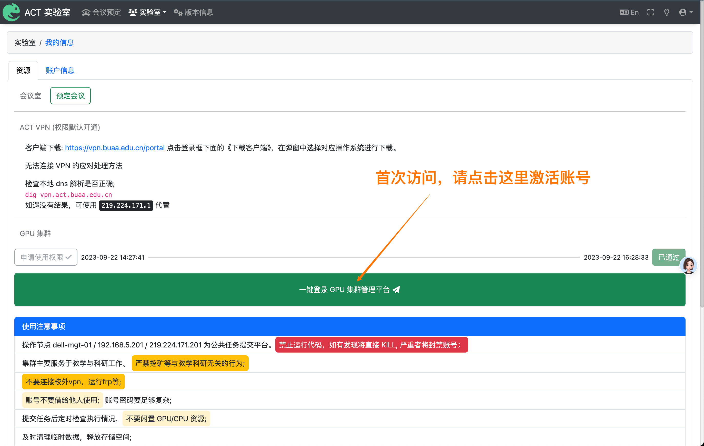

# 平台访问

为了使用 ACT GPU 平台，您必须拥有一个 ACT 账号。如果您还没有 ACT 账号，请联系杜英杰老师（北航新主楼 G512）.

## 申请 GPU 集群访问权限

:::tip 注意

如果您之前已经申请过 Slurm GPU 集群的访问权限，那么您可以跳过这一步。

:::

登录 [ACT 实验室用户平台](https://user.act.buaa.edu.cn/)，这里可以预订会议室、申请 GPU 集群访问权限等。

首先点击右上角的头像框，登录平台。

之后点击顶部导航栏的「实验室」，然后选择「我的信息」。

如果您还没有 GPU 集群的访问权限，那么您看到的界面应该是这样的：

请点击「申请使用权限」，填写申请表单，等待管理员（杜英杰老师）审核。

## 激活 Crater GPU 平台账号

:::tip 注意

首次使用需要按此步骤激活账号，后续登录可直接在 Crater 平台操作。

:::

开通成功后，您可以在「实验室」->「我的信息」中看到新的 GPU 集群访问按钮。

第一次登录平台时，必须通过此按钮进行账号激活，激活后将同步导师、课题组等信息到此平台。

后续登录时，可直接使用 ACT 账号在 Crater 平台登录。

## 常见问题

### 1. 在实验室外部如何访问 GPU 集群？

客户端下载: https://vpn.buaa.edu.cn/portal 点击登录框下面的《下载客户端》，在弹窗中选择对应操作系统进行下载。

无法连接 VPN 的应对处理方法

检查本地 dns 解析是否正确;
dig vpn.act.buaa.edu.cn
如遇没有结果，可使用 219.224.171.1 代替 vpn.act.buaa.edu.cn 进行访问;
