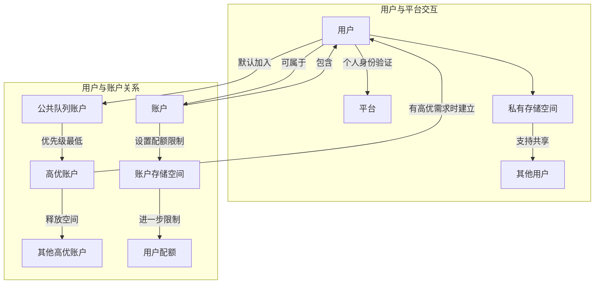

# 用户与账户

内测阶段，我们暂时没有开放用户和账户完整的配额能力，目前每个用户的提交无上限，按照 FIFO 规则排队，因此您不需要关注这一节。

后续随着用户增加，我们可能完善有关配额的详细内容。

```mermaid
flowchart TD
    subgraph 用户与平台交互
        用户 -->|个人身份验证| 平台
        用户 --> 私有存储空间
        私有存储空间 -->|支持共享| 其他用户
    end
    subgraph 用户与账户关系
        用户 -->|可属于| 账户
        用户 -->|默认加入| 公共队列账户
        账户 -->|包含| 用户
        公共队列账户 -->|优先级最低| 高优账户
        高优账户 -->|有高优需求时建立| 用户
        高优账户 -->|释放空间| 其他高优账户
        账户 -->|设置配额限制| 账户存储空间
        账户存储空间 -->|进一步限制| 用户配额
    end
```
