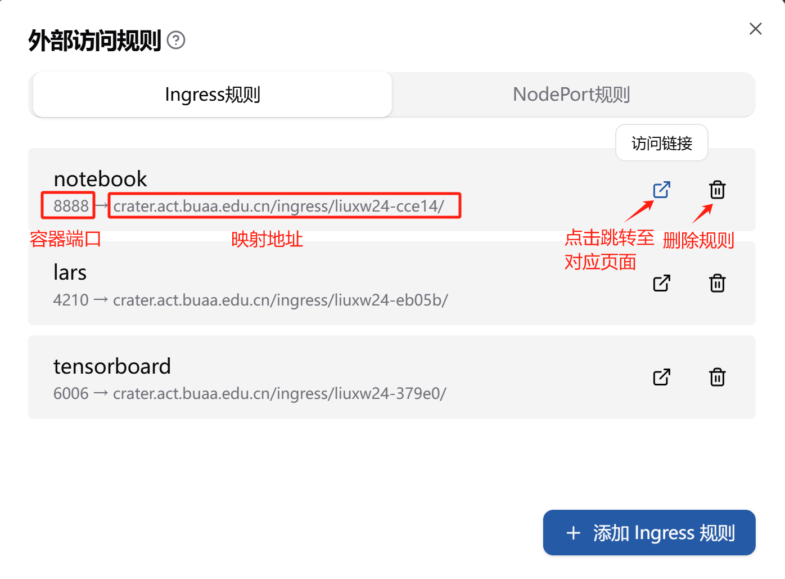
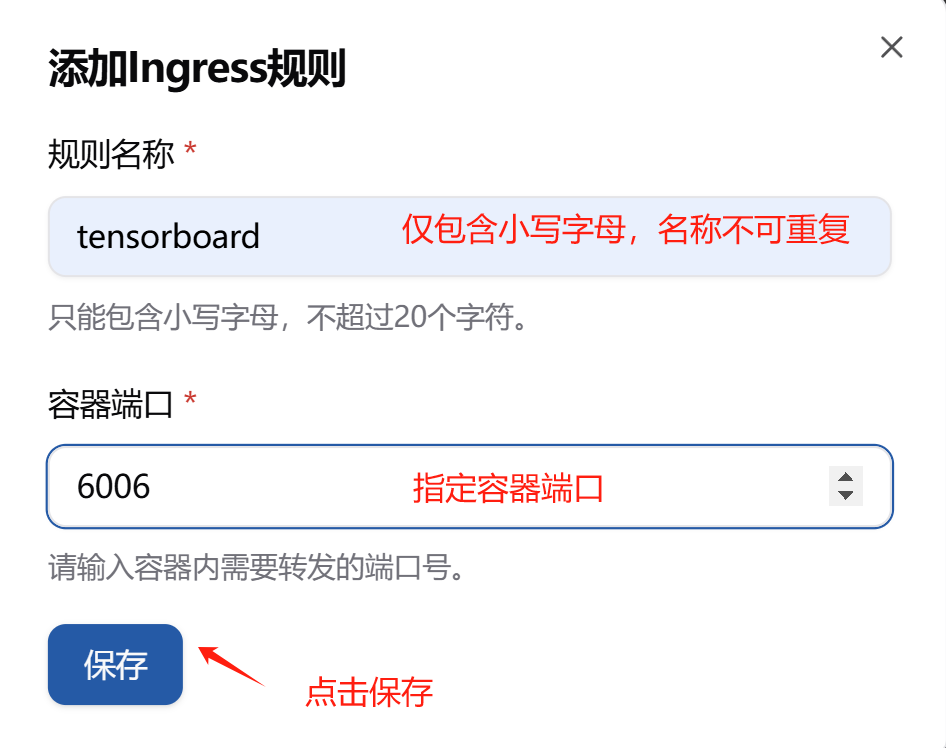
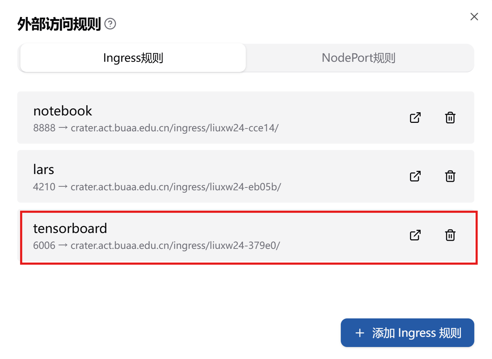
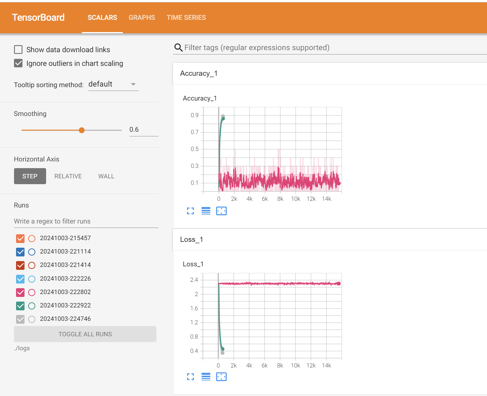

 

# Ingress 访问规则

## 1.1 功能介绍

**Ingress 规则** 通过 HTTP 或 HTTPS 协议对外暴露 Kubernetes 集群中的服务。它适用于基于 Web 的应用，如 **TensorBoard**、**Visdom**、**Jupyter** 等。使用 Ingress 规则，您可以指使得外部访问者可以通过特定的路径访问服务。

例如，如果您希望通过 TensorBoard 或 Visdom 访问服务，在容器中暴露服务至相应端口，并将它们映射到集群中的服务。Ingress 控制器会自动处理这些请求，转发到集群中的对应服务，并根据需求支持 HTTPS 和 HTTP 协议。

**优势**：
- 适用于 Web 服务的暴露。
- 支持 HTTP/HTTPS 协议。

**使用场景**：

- 访问 TensorBoard。
- 访问 Visdom。
- 访问 Jupyter Notebook。

**转发路径**： 所有的访问路径均采用统一格式：`crater.act.buaa.edu.cn/ingress/{userName}-{uuid}`。其中，`userName`  是用户名，`uuid` 为自动生成的五位标识符，指向特定的服务。



设置完成后会在对应 Pod 的 `Annotations` 中看到如下内容，使用 `ingress.crater.raids.io` 作为 `key` 值：

```yaml
metadata:
  annotations:
    crater.raids.io/task-name: tensorboard-example
    ingress.crater.raids.io/lars: '{"Name":"lars","Port":4210,"Prefix":"/ingress/liuxw24-eb05b/"}'
    ingress.crater.raids.io/tensorboard: '{"Name":"tensorboard","Port":6006,"Prefix":"/ingress/liuxw24-379e0/"}'
    ingress.crater.raids.io/notebook: '{"Name":"notebook","Port":8888,"Prefix":"/ingress/liuxw24-cce14/"}'
```

## 1.2 使用示例


当您希望将 Web 应用暴露给外部访问时，您可以使用 **Ingress 规则**。例如，您可以为 TensorBoard 配置一个 Ingress 规则，使得外部用户能够通过浏览器访问该服务。

### 设置 Ingress 外部访问规则

**设置 Ingress 外部访问规则的步骤如下：**

1. 在作业详情页点击 **设置外部访问规则**。

   

2. 点击弹出的对话框中点击 **“添加 Ingress 规则”** ，输入对应的**规则名称**（仅包含小写字母，不超过20个字符，不可重复），以及**容器端口**，点击保存。

   

3. 保存成功后即可看到**相应的 Ingress 规则**。

   

**示例配置**：

```json
{
    "Name": "tensorboard",
    "Port": 6006,
    "Prefix": "/ingress/liuxw24-379e0/",
}
```

**字段说明**：

- **端口号** (`port`): 自定义端口号，这里设置为 `6006`，因为 TensorBoard 默认使用此端口。
- **访问路径** (`prefix`): 访问路径会被映射为 `crater.act.buaa.edu.cn/ingress/{userName}-{uuid}`，其其中，`userName`  是用户名，`uuid`为 自动生成的五位标识符。

### 在容器内启动 TensorBoard

> TensorBoard 是一个用于可视化深度学习模型训练过程等相关数据的工具。通常情况下，它会在本地默认的 URL（如 `http://localhost:6006/` ）下启动服务来展示数据。但在一些场景下，比如在服务器环境或者通过反向代理等方式访问时，需要指定一个自定义的 baseurl 来正确地访问 TensorBoard。

**指定 baseurl 的方法如下**（以命令行方式启动为例）：

当通过命令行启动 TensorBoard 时，可以使用 `--logdir` 参数指定日志目录，同时使用 `--bind_all` 和 `--path_prefix` 参数来指定 baseurl 相关的设置。

假设您的 TensorBoard 日志目录是 `/path/to/logs` ，想要设置的 baseurl 为 `/tensorboard` ，可以使用以下命令：

```bash
tensorboard --logdir=/path/to/logs --bind_all --path_prefix=/tensorboard
```

其中 `--bind_all` 参数是让 TensorBoard 绑定所有的网络接口，这样可以从其他机器访问（如果需要该功能）。

`--path_prefix` 参数就是用于指定 baseurl 的部分。在这个例子中，你可以通过访问类似 `http://your_server_ip:6006/tensorboard` 的 URL 来查看 TensorBoard（这里假设默认端口是 6006）。

**您需要在容器内启动TensorBoard，并进行相关配置，步骤如下：**

打开终端或命令提示符并运行：

```bash
tensorboard --port {port} --logdir {your-logs-dir} --bind_all --path_prefix={your-ingress-prefix}
```

其中各个参数的解释如下：

- `port`：指定端口，默认为6006

- `{your-logs-dir}`：用户指定的训练数据的输出目录（如`./logs`)

- `--bind_all`：使得 TensorBoard 绑定所有的网络接口，这样可以从其他机器访问

- `{your-ingress-prefix}`：指定的 Ingress 访问路径，在本示例中为 `/ingress/liuxw24-379e0`（参见 Ingress 访问规则中的设置）


**访问方式**：

- 用户可以通过 `gpu.act.buaa.edu.cn/ingress/{userName}-{uuid}` 路径访问 TensorBoard，看到对应页面如下：

  