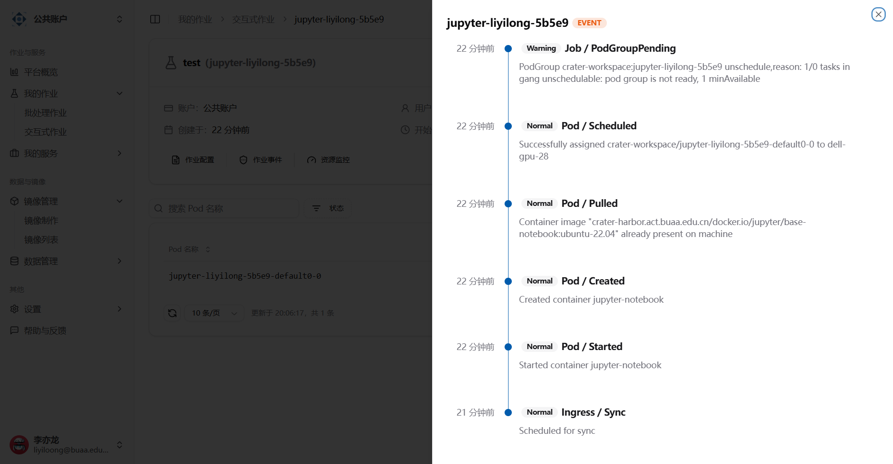
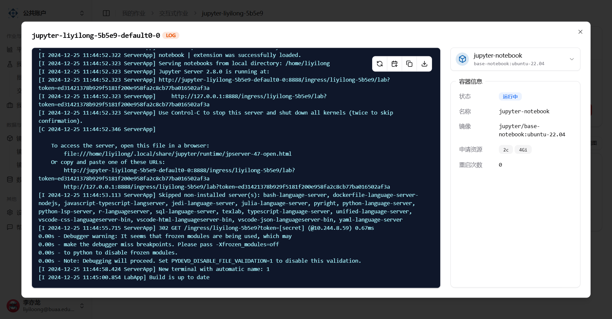

# 日志与诊断

关于日志和诊断的功能，我们提供了一些工具，以帮助您更好地了解和调试您的作业，这些工具都在 [作业详情页](../quick-start/interactive#作业详情页)。

## 作业相关的事件

在作业详情页，点击作业事件按钮，可以查看近一小时的事件。

由于是从集群上获取的事件，默认情况是全英文的，您可以重点关注：

1. 事件发生的时间，比如截图中的 PodGroupPending 警告，在那之后作业成功被调度并执行了，因此可以忽略。
2. Normal 事件和 Warning 事件：更加关注 Warning 事件。

## 作业相关的日志

作业成功被调度并启动后，您可以查看该作业对应 Pod 的日志信息。

有关可能遇到的问题，请参考 [常见问题](../category/常见问题/)。
