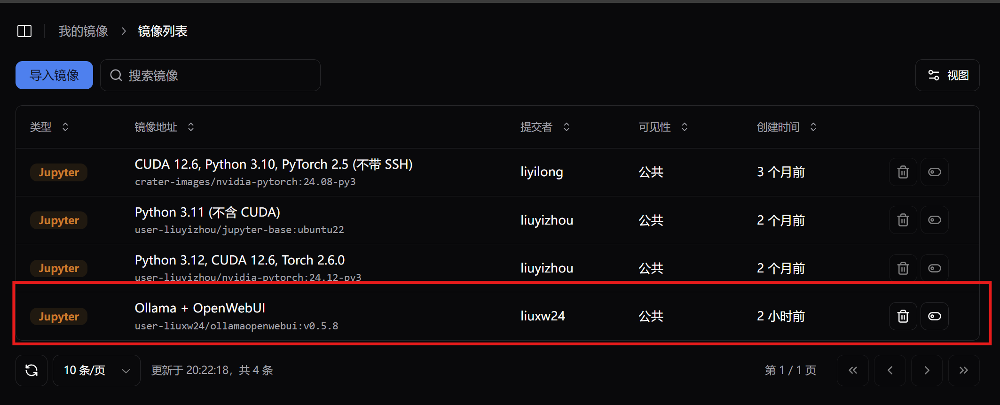
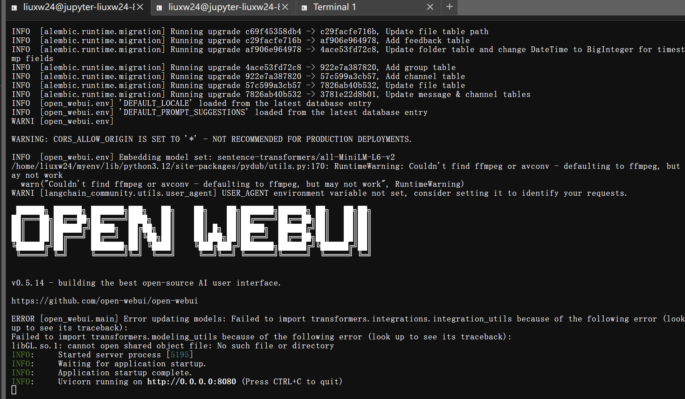
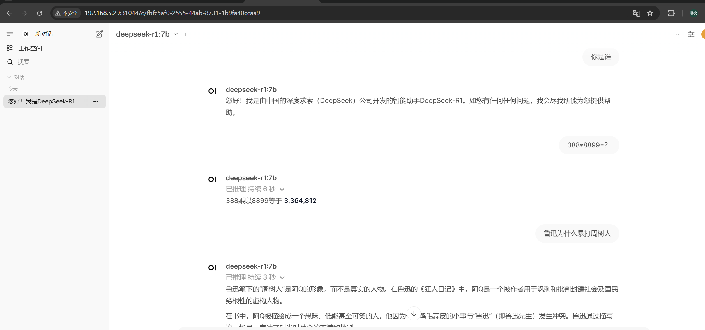
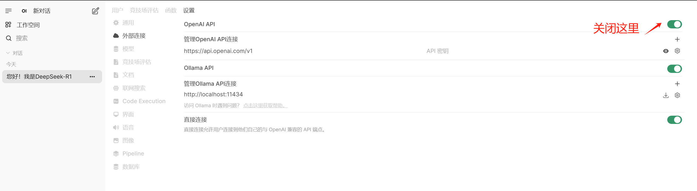

# 部署属于您自己的DeepSeek🐋

>  使用方案：Ollama + Open WenUI

## 快速部署

本平台提供了包含 Ollama + Open WenUI 的镜像，可以直接使用其创建 Jupyter 任务。



### 切换用户并激活虚拟环境

创建成功后切换到 `ollama` 用户进行后续操作（已配置 sudo 免密）

```bash
sudo su - ollama
```

激活 `ollama` 虚拟环境，参考命令如下：

```bash
source /home/ollama/ollama/bin/activate
```

成功切换用户并激活虚拟环境后显示如下：

```bash
(ollama) ollama@jupyter-liuxw24-515fc-default0-0:
```

### 运行 Ollama

```bash
ollama serve
```

保持 Ollama 处于运行状态，在另一个终端运行需要的模型，比如可以使用如下命令运行 deepseek-r1:7b

```bash
ollama run deepseek-r1:7b
```

:::warning

**⚠️ 初次运行 Ollama 模型时需要下载（Pull）模型文件**  

在 **Ollama** 中首次运行某个模型时，系统会自动从官方或指定的源 **Pull（下载）** 该模型。由于 **模型文件通常非常大**（可能达到 **GB 级别**），每个用户单独下载相同的模型 **会消耗大量带宽、存储资源，并影响系统性能**。  

**🌟 推荐方案：挂载现有模型**

为了**避免重复下载**，我们建议 **将已有的模型文件挂载到 Ollama 的模型存储目录**，这样所有用户都可以直接访问，避免重复下载带来的资源浪费。


**📌 挂载示例：**

如果已有模型文件存储在 `/path/to/local/models/`，可以在启动 Ollama 时挂载到默认的模型存储路径，Ollama 模型文件的默认存储路径如下：

```bash
/home/ollama/.ollama/models/manifests/registry.ollama.ai/library/{model_name}/{model_parameters}
```

例如，目前本平台提供的 `DeepSeek-R1-Q4_K_M` 模型，可以在提交 Jupyter 作业时将其挂载至 `/home/ollama/.ollama/models/manifests/registry.ollama.ai/library/deepseek-r1/`

这样，Ollama 在运行时会**直接使用已有的模型**，无需重新 Pull，既节省资源，也提高了加载速度。 🚀

:::

### 运行 Open WebUI

```bash
open-webui serve
```

成功运行显示如下：




### 后续步骤

安装完成后：

- 当使用 Python 部署时，访问`http://localhost:8080/`
- 在集群上访问可以使用 NodePort 规则，暴露8080容器端口，具体操作可以参考 [NodePort 访问规则](./external-access/nodeport-rule.md)


**成功访问后显示如下**：




### FAQ

#### open webui 打开后白屏


open-webui在首次打开时默认对接了open-ai的Api，但是没有使用魔法 ~~(科学上网)~~ 的话，会一直等待响应，只需要关闭即可。

访问入口：管理员面板 -->设置 -->外部连接-> openAi API



## 完整部署流程

您如果想从头开始完整部署，本文档提供的参考流程如下：

### 部署Ollama 

[Ollama](https://ollama.com/) 是一款基于Go语言构建的开源框架，可在本地电脑或服务器上部署和运行如DeepSeek、Llama 3、Mistral、Qwen等多种大型语言模型。它采用类似Docker的操作方式，有list、pull、push、run等命令方便用户管理模型，还提供API接口便于集成进应用。具有本地部署保障数据安全、降低成本、支持离线使用、易于上手等特点。

下载理论上只需要如下这条命令：

```bash
curl -fsSL https://ollama.com/install.sh | sh
```

但实际由于网络问题安装速度可能会很慢，本次部署中采用了 [**modelscope/ollama-linux**](https://modelscope.cn/models/modelscope/ollama-linux) 的解决方案 

该repo提供ollama的Linux版本安装文件，及对应的安装脚本，可在包括在ModelScope Notebook等Linux环境上运行。


当前最新版本（revision v0.5.8）对应ollama v0.5.8 release。同时本模型库也提供更早的版本，可通过 revision 参数来切换。

#### 使用命令行下载

该方式为下载Ollama安装包的**推荐方式**，能避免git lfs额外数据的下载。

```
# 使用命令行前，请确保已经通过pip install modelscope 安装ModelScope。
modelscope download --model=modelscope/ollama-linux --local_dir ./ollama-linux --revision v0.5.8
```

#### 安装 Ollama

下载安装包后，可以进入ollama-linux文件夹，确定安装脚本具备运行权限后，运行安装脚本，此脚本**无需网络链接即可安装ollama**。

```
# 运行ollama安装脚本
cd ollama-linux
sudo chmod 777 ./ollama-modelscope-install.sh
./ollama-modelscope-install.sh
```

也可以通过git clone来下载安装包：

```
#Git clone，可以使用--depth 1选项减少下载的git历史文件
git clone https://www.modelscope.cn/modelscope/ollama-linux.git --depth 1 --branch v0.5.8
```

更多ollama文档，包括在其他操作系统上安装ollama，可参见 [ollama 官方网站](https://ollama.com/)

#### 启动 Ollama 

安装完成后可以通过如下指令来测试是否安装成功：

```bash
$ ollama -v
ollama version is 0.5.8-rc10
```

执行以下命令启动 ollama：

```bash
$ ollama serve
```

### 安装Open WebUI

[Open WebUI](https://openwebui.com/) 是一款开源的、功能丰富且用户友好的AI交互界面工具。它支持ollama和OpenAI兼容的API等多种语言模型运行器，可本地化部署，具备多模型集成与切换、精细权限管理、跨平台响应式设计、实时语音视频通话等功能，还支持本地RAG集成、网页搜索、图像生成等。

Open WebUI 提供了 [多种安装方式](https://docs.openwebui.com/getting-started/)，由于本次部署在 Jupyter 容器内进行，选择了 Python venv 的方式，具体操作如下：

#### 使用虚拟环境安装

使用`venv`创建隔离的 Python 环境。

```bash
python3 -m venv venv
source venv/bin/activate
pip install open-webui
```

**启动服务器**

```bash
open-webui serve
```

