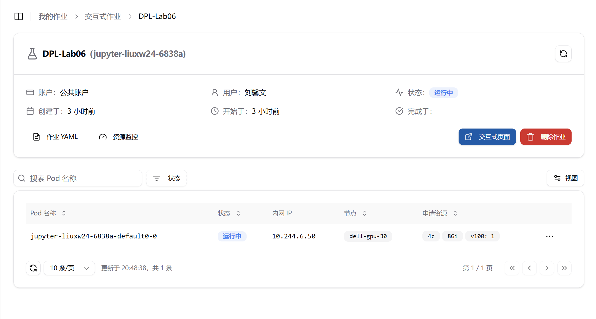
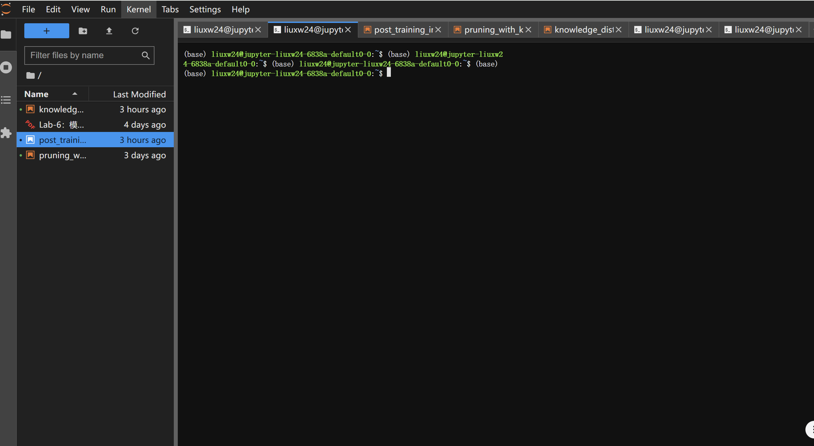
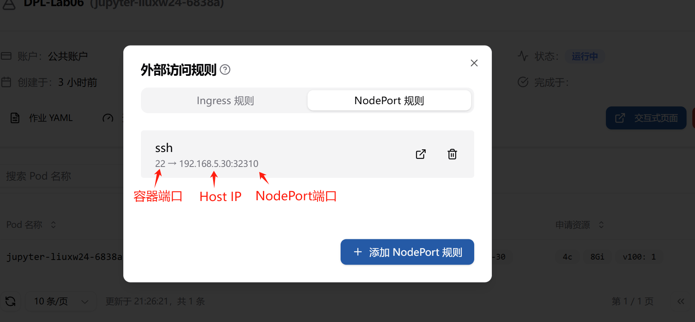
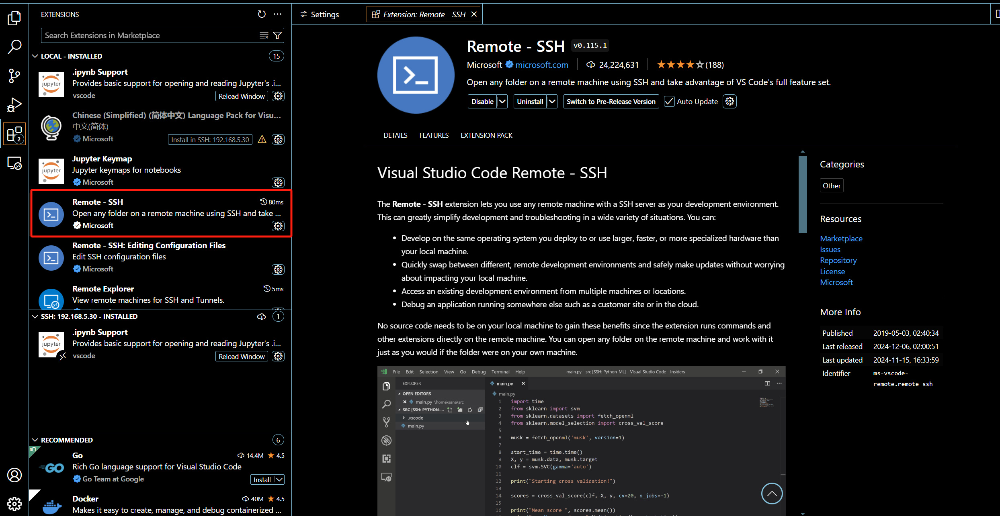
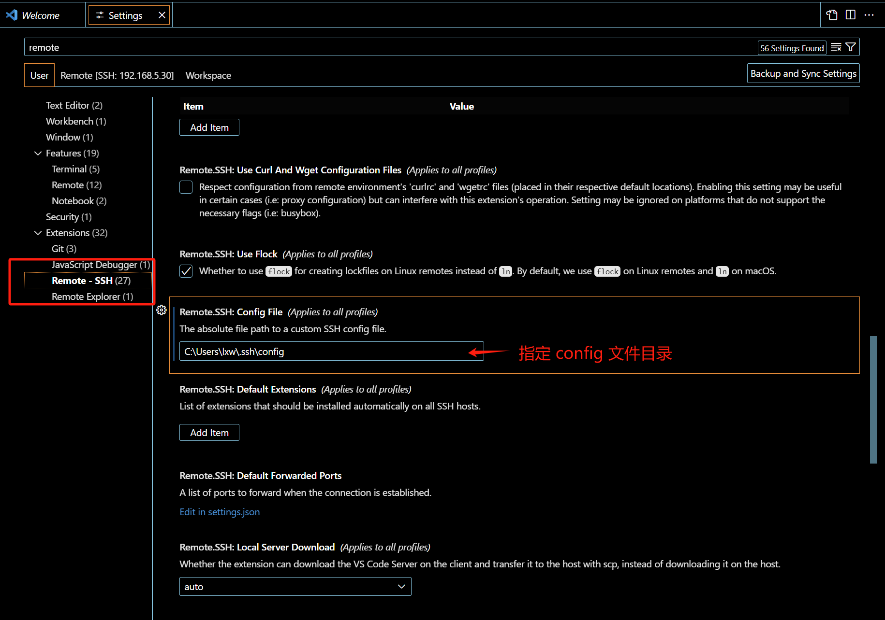
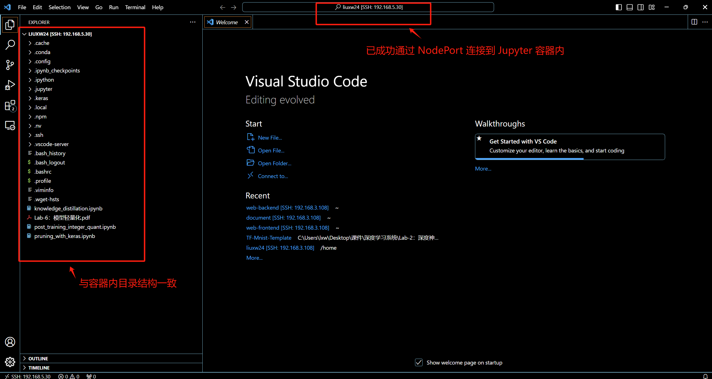

# VSCode 连接到 Jupyter 容器内

支持用户在创建 Jupyter 作业后，通过 VSCode 直接连接到容器环境，便于利用 VSCode 的代码补全、调试功能以及丰富的插件生态，从而提升开发效率与用户体验。

## 确保本机已生成公私钥

在开始之前需要确保在本机已生成公私钥文件，通常存储在`C:\Users\<用户名>\.ssh`或` ~/.ssh`目录下，如：

```bash
C:\Users\<用户名>\.ssh\id_rsa
C:\Users\<用户名>\.ssh\id_rsa.pub

~/.ssh/id_rsa
~/.ssh/id_rsa.pub
```

若未生成可以通过如下类似命令生成：

```bash
ssh-keygen -t rsa -b 4096 -C "your_email@example.com"
```


## 创建 Jupyter 作业

用户创建 Jupyter 作业，具体创建方法可参考详见 [交互式作业](../quick-start/interactive.md)，示例作业如下：



点击“交互式页面”跳转到 Jupyter Notebook 




## 容器内安装 SSHD

**SSHD（SSH Daemon）**：SSHD 是 SSH 服务的守护进程，负责监听指定端口上的 SSH 连接请求并提供相应的服务。安装和运行 SSHD 可以使容器能够通过 SSH 协议进行远程访问。

### **安装 OpenSSH Server**

```bash
sudo apt update
sudo apt install -y openssh-server
```

### 验证 SSH 服务是否正常启动

可以运行以下命令，手动检查 `sshd` 是否已安装：

```bash
ps -ef | grep sshd
```

也可以使用 `service` 命令检查和管理 SSHD 的运行状态：

**使用 service 命令重启 ssh 服务**

```bash
sudo service ssh restart
```

**检查状态**

```bash
sudo service ssh status
```

参考输出如下：

```bash
(base) liuxw24@jupyter-liuxw24-6838a-default0-0:~$ sudo service ssh restart
 * Restarting OpenBSD Secure Shell server sshd                       [ OK ] 
(base) liuxw24@jupyter-liuxw24-6838a-default0-0:~$ sudo service ssh status
 * sshd is running
```

### 确认 22 端口正常监听

使用以下命令确认 `22` 端口是否在监听：

```bash
sudo netstat -tuln | grep 22
```

如果一切正常，`sshd` 服务将会在指定端口监听并接受连接。

### 配置 SSH 免密登录

可使用 `authorized_keys` 配置免密登录，上传公钥（通常是 `id_rsa.pub`）到服务器（在“确保本机已生成公私钥”章节中已阐述）。

- 若 `.ssh` 文件夹不存在，可执行以下命令创建 `.ssh` 文件夹，并设置适当的权限：

```bash
mkdir ~/.ssh
chmod 700 ~/.ssh
```

- 将本机公钥添加到 `~/.ssh/authorized_keys` 文件

```bash
# 将本机 id_rsa.pub 文件内容复制到 ~/.ssh/authorized_keys
vim ~/.ssh/authorized_keys
# 为 authorized_keys 设置适当权限
chmod 600 ~/.ssh/authorized_keys
```


## 设置 NodePort 规则

可通过设置外部访问规则中的 **NodePort 规则** 暴露服务端口，并使用 NodePort 端口在 VSCode 中连接到 Jupyter 容器内。

NodePort 规则允许用户通过集群节点的 IP 地址和指定的端口号进行访问。如果您希望通过 SSH 连接到集群中的某个节点，Kubernetes 会为该服务分配一个端口，您可以通过该端口号从外部进行连接。

在 Jupyter 作业详情页创建 NodePort 规则，详细创建流程介绍参见 [设置 NodePort 访问规则](../toolbox/external-access/nodeport-rule.md)。



**字段说明**：

- **容器端口号** (`containerPort`): 选择 **22** 端口，用于 SSH 服务。

- **集群节点地址**(`address`): 集群任一节点的IP地址，此处为`192.168.5.30`。

- **所分配的NodePort端口**(`nodePort`): Kubernetes 会自动从端口范围 30000 到 32767 中为服务分配一个端口号，此处为`32310`。

  

## VSCode 配置

### 安装 Remote-SSH 扩展

VSCode 中要安装 Remote-SSH 扩展，见下：



### 配置 **Remote.SSH Config** 文件

在设置中指定 **Remote.SSH Config** 文件的路径：



config 文件参考配置如下：

```yaml
Host 192.168.5.30
  HostName 192.168.5.30
  LogLevel verbose
  IdentityFile C:\Users\lxw\.ssh\id_rsa
  Port 32310
  User liuxw24
```

各字段解释如下：

- `Host`：Host IP，参见 NodePort 规则中的 `Host IP`，本示例中为`192.168.5.30`
- `IdentityFile`：指定私钥文件的访问路径
- `Port`：要连接的端口号，参见 NodePort 规则中的 `NodePort 端口号`，本示例中为`32310`
- `User`：用户名

配置完成后即可成功通过 NodePort 在 VSCode 中连接到 Jupyter 容器内：

